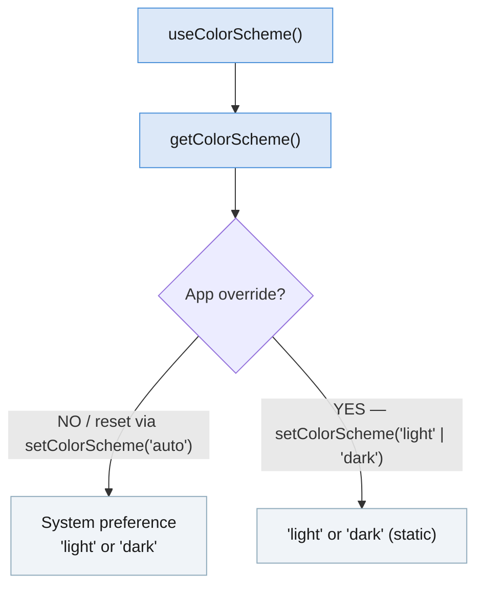

import Tabs from '@theme/Tabs'; import TabItem from '@theme/TabItem'; import constants from '@site/core/TabsConstants';

```tsx
import {Appearance} from 'react-native';
```

`Appearance` 模块提供了用户外观偏好相关的信息，例如用户偏好的配色方案（浅色或深色）。

#### 开发者说明

<Tabs groupId="guide" queryString defaultValue="web" values={constants.getDevNotesTabs(["android", "ios", "web"])}>

<TabItem value="web">

:::info
`Appearance` API 的灵感来自 W3C 的[媒体查询草案](https://drafts.csswg.org/mediaqueries-5/)。配色方案偏好基于 [`prefers-color-scheme` CSS 媒体特性](https://developer.mozilla.org/en-US/docs/Web/CSS/@media/prefers-color-scheme) 建模。
:::

</TabItem>
<TabItem value="android">

:::info
在 Android 10（API level 29）及更高版本的设备上，配色方案偏好将映射到用户的浅色或[深色主题](https://developer.android.com/guide/topics/ui/look-and-feel/darktheme)偏好。
:::

</TabItem>
<TabItem value="ios">

:::info
在 iOS 13 及更高版本的设备上，配色方案偏好将映射到用户的浅色或[深色模式](https://developer.apple.com/design/human-interface-guidelines/ios/visual-design/dark-mode/)偏好。
:::

:::note
截屏时，配色方案可能会在浅色和深色模式之间闪烁。这是因为 iOS 会分别在两种配色方案下拍摄快照，而配色方案的更新是异步的。
:::

</TabItem>
</Tabs>

## 示例

你可以使用 `Appearance` 模块来判断用户是否偏好深色配色方案：

```tsx
const colorScheme = Appearance.getColorScheme();
if (colorScheme === 'dark') {
  // 使用深色配色方案
}
```

虽然配色方案值可以立即获取，但在未通过 `setColorScheme()` 进行覆盖时，该值可能会发生变化（例如在日出或日落时自动切换配色方案）。任何依赖于用户偏好配色方案的渲染逻辑或样式都应该在每次渲染时调用此函数，而不是缓存该值。

**推荐：** 使用 [`useColorScheme`](usecolorscheme) hook。

### 应用级覆盖

`setColorScheme()` 在应用级别覆盖配色方案——它不会影响系统设置或其他应用。传入 `'auto'` 将移除任何覆盖，恢复系统偏好。



---

# 文档

## 方法

### `getColorScheme()`

```tsx
static getColorScheme(): 'light' | 'dark' | null;
```

返回当前激活的配色方案。该值可能会在运行时发生变化——可能在系统级别（例如在日出或日落时自动切换配色方案），也可能通过 `setColorScheme()` 在应用级别进行覆盖。

返回值：

- `'light'`：浅色配色方案已激活。
- `'dark'`：深色配色方案已激活。
- `null`：当原生 Appearance 模块不可用时可能返回此值。

另见：[`useColorScheme`](usecolorscheme)（hook）。

---

### `setColorScheme()`

```tsx
static setColorScheme('light' | 'dark' | 'auto' | 'unspecified'): void;
```

强制应用始终采用浅色或深色界面风格。该更改应用于应用及其内部所有原生元素（Alert、Picker 等）。

这是应用级别的覆盖——它不会影响系统所选的界面风格，也不会影响其他应用中设置的任何风格。

支持的值：

- `'light'`：采用浅色配色方案。
- `'dark'`：采用深色配色方案。
- `'auto'`：跟随系统配色方案（移除任何覆盖）。
- `'unspecified'`（**已弃用**）：跟随系统配色方案（移除任何覆盖）。

---

### `addChangeListener()`

```tsx
static addChangeListener(
  listener: (preferences: {colorScheme: 'light' | 'dark' | null}) => void,
): NativeEventSubscription;
```

添加一个事件监听器，在外观偏好发生变化时触发。在 iOS 和 Android 上，回调中的 `colorScheme` 值始终为 `'light'` 或 `'dark'`。
