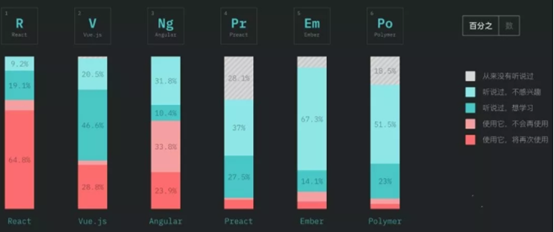

根据《2018 年度JavaScript趋势报告》显示，目前React 在前端领域流行度最高， Vue 排名位居第二，但从“使用过并且将再次使用”的比例来看，Vue和React相比仍有不小差距。

 

> （注：共有来自 153 个不同的国家共 20000 多名 JavaScript 开发者参与调查，中国共75个开发者占总数的 0.37%，中国也许这个数据会有一些不同）

除Facebook，Instagram，Netflix，微软等众多国际知名互联网公司都是React.js的拥趸者外，国内很多主流互联网公司如腾讯、蚂蚁金服、京东、360、美团、携程等也在用 React ，即使有大厂由于业务等原因不直接使用，但仍没有脱离React社区。

所以对于每个想进大厂的前端开发者来说，**React是绕不过的坎**。React相关问题基本是面试必考，如果能深入理解React的灵魂，包括虚拟DOM，JSX，函数式编程和immutable，单向数据流，组件化抽象，生命周期等，在面对其他轮子时你也能做到得心应手。

但大家都知道React 学习曲线比较陡峭，不少人抱怨：**自己死磕了1个多月却进展缓慢怎么办？**

别着急，今天整理了一份 **《React 原理剖析》+《react组件化》两个视频**，带着大家快速了解 React 的基本逻辑和语法

#### 视频尤其适合

* 对react有了解，但苦于无法深耕和提升的程序员；
* 了解js以及react简单用法，被react反复折磨无解的程序员

视频内容要点分别如下：

#### 《react原理剖析》

1. 源码解读基本思路介绍

    涉及知识点：react源码入口

2. JSX、createElement和虚拟DOM的关系

    涉及知识点：JSX、createElement、虚拟DOM

3. React.createElement的实现

    涉及知识点：createElement

4. Component创建、虚拟节点类型判定

    涉及知识点：Component、虚拟节点类型

5. vdom转换为dom

    涉及知识点：dom转换

6. 样式处理、vdom数组渲染

    涉及知识点：样式处理、vdom数组渲染

7. setState工作流程

    涉及知识点：setState

8. diff和patch过程解读

    涉及知识点：diff算法，patch算法

#### 《react组件化》

1. 复习

    涉及知识点：react+reactDOM jsx react基本用法

2. 试用ant-design组件库

    涉及知识点：Button组件的使用 配置按需加载

3. 容器组件vs展示组件

    涉及知识点：容器组将和展示组件的优势弊端以及解决办法（附带源码）

4. react.memo

    涉及知识点：React.memo代替PureComponent进行改装

5. 高阶组件

    涉及知识点：链式调用 装饰器写法

6. 组件复合

    涉及知识点：组件之间的交互 Composition实现vue具名插槽

7. children是什么？

    案例演示涉及知识点：修改children 组件编写

希望这两个视频资料能帮助大家深入理解react原理，对工作和面试中都能提供强大支持。视频现在 **限量免费** 开放，获取方式：扫描文末二维码→添加小助理微信领取。

扫描下方二维码，添加小助理，即可获得专属优惠观看链接，机会难得，需要的朋友尽快报名～

 

> 扫描二维码    添加小助理微信

通过申请后会逐个开通权限，小助手精力有限，手慢无哦! 

框架变来变去，底层却还是那些东西，学习源码练好内功，大家千万别做收藏党。视频由**开课吧**提供，感谢开课吧一直以来的友情支持。

**开课吧：** 致力于打造互联网从业者职业成长平台。现在面向前端程序员，专门打磨了进阶课程 **《Web全栈架构师》**，帮助大家打破技术瓶颈，提高自身竞争力，实现职业的可持续成长。

对课程感兴趣同样可以加微信咨询。