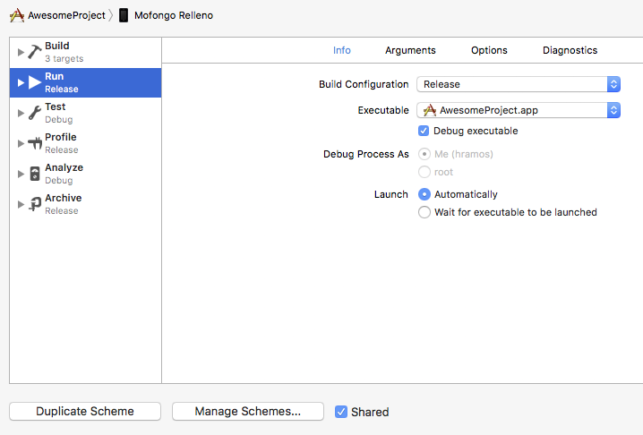

上架应用的过程和任何其它原生 iOS 应用一样，但有一些额外的注意事项要考虑。

> If you are using Expo then read the Expo Guide for [Building Standalone Apps](https://docs.expo.io/versions/latest/distribution/building-standalone-apps/).

### 1. 启用 App Transport Security

App Transport Security 是 iOS 9 引入的一项安全特性，拒绝不通过 HTTPS 发送的所有 HTTP 请求。这会导致 HTTP 传输阻塞，包括开发者 React Native 服务器。为了使开发容易，在 React Native 项目中 ATS 默认为`localhost`禁用。

你应该在构建生产应用之前重新启用 ATS，方法是删除 `ios/` 文件夹中的 `Info.plist` 文件中的 `NSExceptionDomains` 字典中的 `localhost` 条目，并将 `NSAllowsArbitraryLoads` 设置为 `false`。你也可以在 Xcode 中通过打开目标属性下的 Info 面板并编辑 App Transport Security Settings 条目来重新启用 ATS。

> 如果你的应用需要访问生产环境中的 HTTP 资源，请参阅 [这篇文章](http://ste.vn/2015/06/10/configuring-app-transport-security-ios-9-osx-10-11/) 了解如何配置项目中的 ATS。

### 2. 配置 release scheme

需要在 Xcode 使用`Release` scheme 编译在 App Store 发布的 app。`Release`版本的应用会自动禁用开发者菜单，同时也会将 js 文件和静态图片打包压缩后内置到包中，这样应用可以在本地读取而无需访问开发服务器（同时这样一来你也无法再调试，需要调试请将 Build Configuration 再改为 debug）。  
由于发布版本已经内置了 js 文件，因而也无法再通过开发服务器来实时更新。面向用户的热更新，请使用专门的[热更新服务](https://pushy.reactnative.cn)。

要配置 app 为使用`Release` scheme 编译，请前往**Product** → **Scheme** → **Edit Scheme**。选择侧边栏的**Run**标签，然后设置下拉的 Build Configuration 为`Release`。



#### 关于启动屏的优化技巧

随着 App 包大小的增长，可能开始在启动屏(splash)和根应用视图显示之间看到白屏闪现。如果是这样，为了在转换期间保持启动屏显示，可以添加下列代码到`AppDelegate.m`。

```objectivec
  // Place this code after "[self.window makeKeyAndVisible]" and before "return YES;"
  UIStoryboard *sb = [UIStoryboard storyboardWithName:@"LaunchScreen" bundle:nil];
  UIViewController *vc = [sb instantiateInitialViewController];
  rootView.loadingView = vc.view;
```

静态包在每次你目标物理设备时都会生成，即使在 Debug 模式下也是如此。如果你想节省时间，可以通过在 Xcode Build Phase `Bundle React Native code and images` 的 shell 脚本中添加以下内容来在 Debug 模式下关闭包生成：

```sh
 if [ "${CONFIGURATION}" == "Debug" ]; then
  export SKIP_BUNDLING=true
 fi
```

### 3. 编译发布 app

现在可以通过点击`⌘B`或从菜单栏选择 **Product** → **Build** 编译发布 app。一旦编译发布，就能够向 beta 测试者发布 app，提交 app 到 App Store。

> 你也可以使用 `React Native CLI` 通过 `--configuration` 选项（值为 `Release`，例如 `npx react-native run-ios --configuration Release`）来执行此操作。
