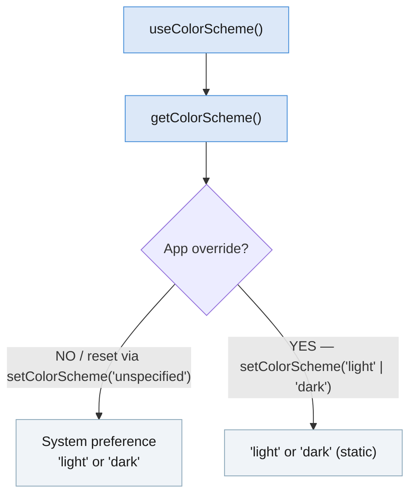

import Tabs from '@theme/Tabs'; import TabItem from '@theme/TabItem'; import constants from '@site/core/TabsConstants';

```tsx
import {Appearance} from 'react-native';
```

The `Appearance` module exposes information about the user's appearance preferences, such as their preferred system color scheme (light or dark).

#### Developer notes

<Tabs groupId="guide" queryString defaultValue="web" values={constants.getDevNotesTabs(["android", "ios", "web"])}>

<TabItem value="web">

:::info
The `Appearance` API is inspired by the [Media Queries draft](https://drafts.csswg.org/mediaqueries-5/) from the W3C. The color scheme preference is modeled after the [`prefers-color-scheme` CSS media feature](https://developer.mozilla.org/en-US/docs/Web/CSS/@media/prefers-color-scheme).
:::

</TabItem>
<TabItem value="android">

:::info
The color scheme preference will map to the user's Light or [Dark theme](https://developer.android.com/guide/topics/ui/look-and-feel/darktheme) preference on Android 10 (API level 29) devices and higher.
:::

</TabItem>
<TabItem value="ios">

:::info
The color scheme preference will map to the user's Light or [Dark Mode](https://developer.apple.com/design/human-interface-guidelines/ios/visual-design/dark-mode/) preference on iOS 13 devices and higher.
:::

:::note
When taking a screenshot, by default, the color scheme may flicker between light and dark mode. It happens because the iOS takes snapshots on both color schemes and updating the user interface with color scheme is asynchronous.
:::

</TabItem>
</Tabs>

## Example

You can use the `Appearance` module to determine if the user prefers a dark color scheme:

```tsx
const colorScheme = Appearance.getColorScheme();
if (colorScheme === 'dark') {
  // Use dark color scheme
}
```

Although the color scheme is available immediately, this may change when not overridden via `setColorScheme()` (e.g. scheduled color scheme change at sunrise or sunset). Any rendering logic or styles that depend on the user preferred color scheme should try to call this function on every render, rather than caching the value.

**Recommended:** Use the [`useColorScheme`](usecolorscheme) hook.

### App-level overriding

`setColorScheme()` overrides the color scheme at the application level — it does not affect the system setting or other applications. Passing `'unspecified'` removes any override, restoring the system preference.



---

# Reference

## Methods

### `getColorScheme()`

```tsx
static getColorScheme(): 'light' | 'dark' | null;
```

Returns the active color scheme. This value may change at runtime, either at the system level (e.g. scheduled color scheme change at sunrise or sunset) or when overridden at the app level via `setColorScheme()`.

Return values:

- `'light'`: The light color scheme is applied.
- `'dark'`: The dark color scheme is applied.
- `null`: May be returned if the native Appearance module is not available.

See also: [`useColorScheme`](usecolorscheme) (hook).

---

### `setColorScheme()`

```tsx
static setColorScheme('light' | 'dark' | 'unspecified'): void;
```

Forces the application to always adopt a light or dark interface style. The change applies to the application and all native elements within it (Alerts, Pickers, etc.).

This is an app-level override — it does not affect the system's selected interface style or any style set in other applications.

Supported values:

- `'light'`: Apply light color scheme.
- `'dark'`: Apply dark color scheme.
- `'unspecified'`: Follow the system color scheme (removes any override).

---

### `addChangeListener()`

```tsx
static addChangeListener(
  listener: (preferences: {colorScheme: 'light' | 'dark' | null}) => void,
): NativeEventSubscription;
```

Add an event handler that is fired when appearance preferences change. On iOS and Android, the `colorScheme` value in the callback is always `'light'` or `'dark'`.
