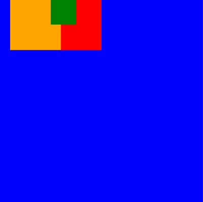

Today we're releasing React Native 0.74! This release adds Yoga 3.0, Bridgeless by default under the New Architecture, batched `onLayout` updates, and Yarn 3 as the default package manager for new projects. We are also actioning API removals for the deprecated `PropTypes` and `PushNotificationIOS` APIs, and Android 6.0 is now the minimum supported Android version.

### Highlights

- [Yoga Improvements](/blog/2024/04/22/0.74-yoga-improvements-preparing-for-the-new-architecture#yoga-improvements)
- [Preparing for the New Architecture](/blog/2024/04/22/0.74-yoga-improvements-preparing-for-the-new-architecture#preparing-for-the-new-architecture)
- [Batched `onLayout` updates (New Architecture)](/blog/2024/04/22/0.74-yoga-improvements-preparing-for-the-new-architecture#batched-onlayout-updates-new-architecture) (**breaking change**)
- [Removal of deprecated `PropTypes`](/blog/2024/04/22/0.74-yoga-improvements-preparing-for-the-new-architecture#removal-of-deprecated-proptypes)
- [API Changes to PushNotificationIOS (Deprecated)](/blog/2024/04/22/0.74-yoga-improvements-preparing-for-the-new-architecture#api-changes-to-pushnotificationios-deprecated)
- [Android SDK minimum bump (Android 6.0)](/blog/2024/04/22/0.74-yoga-improvements-preparing-for-the-new-architecture#android-sdk-minimum-bump-android-60)
- [Yarn 3 for New Projects](/blog/2024/04/22/0.74-yoga-improvements-preparing-for-the-new-architecture#yarn-3-for-new-projects)

### Breaking Changes

- [Breaking Changes](/blog/2024/04/22/0.74-yoga-improvements-preparing-for-the-new-architecture#breaking-changes)

<!--truncate-->

## Highlights

### Yoga Improvements

#### New Layout Behaviors

React Native 0.74 includes [Yoga 3.0](https://yogalayout.dev/blog/announcing-yoga-3.0), the newest version of our layout engine, which enables more correct layout behavior. These changes make styling more predictable, and enable rendering components written for the web with greater fidelity.

React Native intentionally preserves some incorrect layout behaviors, where fixing them was found to effect a signigicant number of real-world components. Layout conformance will be able to be configured more granularly in future versions of React Native.

:::warning

React Native [previously flipped](https://yogalayout.dev/blog/announcing-yoga-3.0#correct-handling-of-logical-edges-in-row-reverse-containers) `left`/`right` (and `start`/`end`) edges when dealing with `margin`, `padding`, or `border`, set on a `row-reverse` container. Code which previously relied on edges being inverted may need to be updated to continue rendering correctly.

<table>
<tr>
  <th>Style</th>
  <th>Before</th>
  <th>After</th>
</tr>
<tr>
<td width="350">

```jsx
<View
  style={{
    flexDirection: 'row',
    backgroundColor: 'red',
    margin: 10,
    width: 200,
    height: 100,
  }}>
  <View
    style={{
      flexDirection: 'row-reverse',
      backgroundColor: 'blue',
      flex: 1,
      marginLeft: 50,
    }}>
    <View
      style={{
        backgroundColor: 'green',
        height: '50%',
        flex: 1,
        marginLeft: 50,
      }}
    />
  </View>
</View>
```

</td>
<td>


</td>
<td>


</td>
</tr>
</table>

:::

#### Support for `align-content: 'space-evenly'`

[`alignContent: 'space-evenly'`](https://developer.mozilla.org/en-US/docs/Web/CSS/align-content#space-evenly) distributes the lines in a multi-line flex container using evenly spaced gaps, placed between line and container edges.

<figure>
  
  <figcaption><small>Source: [World Wide Web Consortium](https://www.w3.org/TR/css-align-3/#distribution-values)</small></figcaption>
</figure>

#### Support for `position: 'static'` (New Architecture)

Elements marked as [`position: 'static'`](https://developer.mozilla.org/en-US/docs/Web/CSS/position#static) may not be offset, and are not considered when determining the [containing block](https://developer.mozilla.org/en-US/docs/Web/CSS/Containing_block) of an absolutely positioned element. This allows positioning an element relative to an ancestor which is not its direct parent.

<table>
<tr>
<td width="350">

```jsx
<View
  style={{
    backgroundColor: 'blue',
    width: 200,
    height: 200,
    flexDirection: 'row-reverse',
  }}>
  <View
    style={{
      backgroundColor: 'red',
      width: 100,
      height: 100,
      position: 'static',
    }}>
    <View
      style={{
        backgroundColor: 'green',
        width: 25,
        height: '25%',
        left: 25,
        top: 25,
        position: 'absolute',
      }}
    />
  </View>
</View>
```

</td>
<td width="300">


</td>
</tr>
</table>

Notice how the green `<View>` declares `left` and `top` and it is positioned relative to the blue `<View>`, not its parent.

`position: 'static'` may also affect [z-ordering](https://developer.mozilla.org/en-US/docs/Web/CSS/CSS_positioned_layout/Understanding_z-index/Stacking_context) of views. Similar to how `position: 'static'` works with containing blocks, static will not be considered when forming stacking contexts. This allows for stacking an element relative to an ancestor that is not a direct parent.

<table>
<tr>
<td width="350">

```jsx
<View
  style={{
    backgroundColor: 'blue',
    width: 200,
    height: 200,
    flexDirection: 'row',
  }}>
  <View
    style={{
      backgroundColor: 'orange',
      width: 50,
      height: 50,
      left: 10,
      position: 'relative',
      zIndex: 10,
    }}
  />
  <View
    style={{
      backgroundColor: 'red',
      width: 50,
      height: 50,
      position: 'static',
    }}>
    <View
      style={{
        backgroundColor: 'green',
        width: 25,
        height: 25,
        zIndex: 11,
        position: 'absolute',
      }}
    />
  </View>
</View>
```

</td>
<td width="300">



</td>
</tr>
</table>

React Native continues to default to `position: 'relative'` when no `position` is set.

### Preparing for the New Architecture

In this release, we are making **Bridgeless Mode the default when the New Architecture is enabled**. You can learn more about our switch to Bridgeless as the default [in this post](link_to_the_post). To make the transition smoother we enhanced the interop layers to cover Bridgeless and worked with several libraries to make sure they will work in Bridgeless from day one.

Bridgeless is not the only interop layer we worked on: we improved the New Renderer Interop layer too! Check out the new features [here](link_to_the_post).

Finally, if you want to learn more about the New Architecture in general, we moved the complete documentation from the React Native website to the [react-native-new-architecture repo](https://github.com/reactwg/react-native-new-architecture/tree/main/docs).

### Batched `onLayout` updates (New Architecture)

State updates in `onLayout` callbacks are now batched. Previously, each state update in the `onLayout` event would result in a new render commit.

```jsx
function MyComponent(props) {
  const [state1, setState1] = useState(false);
  const [state2, setState2] = useState(false);

  return (
    <View>
      <View
        onLayout={() => {
          setState1(true);
       }}>
      <View
         onLayout={() => {
          // When this event is executed, state1's new value is no longer observable here.
          setState2(true);
        }}>
      </View>
    </View>
  );
}
```

In 0.74, `setState1` and `setState2` updates are batched together. This change is [expected behavior in React](https://react.dev/learn/queueing-a-series-of-state-updates#react-batches-state-updates) and allows for less re-renders.

:::danger
This change **may break code** that has relied on un-batched state updates. You'll need to refactor this code to use [updater functions](https://react.dev/learn/queueing-a-series-of-state-updates#updating-the-same-state-multiple-times-before-the-next-render) or equivalent.
:::

### Removal of deprecated `PropTypes`

Before 0.74, React Native shipped with `PropTypes` even though they have been deprecated since React 15.5 in 2017! The presence of this deprecated code incurs costs in app size and memory overhead for apps that follow best practices.

Starting in 0.74, React Native will no longer include the following `PropTypes` properties: `Image.propTypes`, `Text.propTypes`, `TextInput.propTypes`, `ColorPropType`, `EdgeInsetsPropType`, `PointPropType`, `ViewPropTypes` (see [commit](https://github.com/facebook/react-native/commit/228cb80af9ded20107f3c7a30ffe00e24471bfeb)).

If your app or library relies on `PropTypes`, we highly recommend migrating to a type system like TypeScript. **If you have trouble identifying the source of a deleted `PropTypes` usage, please [file an issue](https://github.com/facebook/react-native/issues) so we can help track it down with you.**

### API Changes to PushNotificationIOS (Deprecated)

:::warning
In React Native 0.74, we are making steps to remove the deprecated [PushNotificationIOS](https://reactnative.dev/docs/pushnotificationios) library. The changes in this release are focused on removing references to deprecated iOS APIs. In a future release, this library will be moved out of React Native core and into the community package, [@react-native-community/push-notification-ios](https://github.com/react-native-push-notification/ios).
:::

[PushNotificationIOS (Deprecated)](https://reactnative.dev/docs/pushnotificationios) has been migrated onto Apple’s [User Notification](https://developer.apple.com/documentation/usernotifications?language=objc) framework and exposes new APIs for scheduling and handling notifications. If you are still relying on PushNotificationIOS, you’ll need to migrate over before the next release (0.75) when the deprecated APIs will be removed.

#### API Changes

The `didRegisterUserNotificationSettings:` callback on `RCTPushNotificationManager` was a no-op and has been deleted.

The following callbacks on `RCTPushNotificationManager` have been deprecated and will be removed in 0.75:

```objectivec
+ (void)didReceiveLocalNotification:(UILocalNotification *)notification;
+ (void)didReceiveRemoteNotification:(NSDictionary *)notification;
```

In order to retrieve the notification which launched the app using `getInitialNotification()`, you’ll now need to explicitly set the `initialNotification` on `RCTPushNotificationManager`:

```objectivec
[RCTPushNotificationManager setInitialNotification:response.notification];
```

On the JS side, properties on `Notification` have changed. `alertAction` and `repeatInterval` are now deprecated and will be removed in 0.75:

```js
type Notification = {
  ...
  // NEW: Seconds from now to display the notification.
  fireIntervalSeconds?: ?number,

  // CHANGED: Used only for scheduling notifications. Will be null when
  // retrieving notifications using `getScheduledLocalNotifications` or
  // `getDeliveredNotifications`.
  soundName?: ?string,

  // DEPRECATED: This was used for iOS's legacy UILocalNotification.
  alertAction?: ?string,

  // DEPRECATED: Use `fireDate` or `fireIntervalSeconds` instead.
  repeatInterval?: ?string,
};
```

Finally, the `handler` parameter on `PushNotificationIOS.removeEventListener` is unused and has been removed.

<details>
<summary>**💡 How to Migrate**</summary>

#### iOS

Your `AppDelegate` will need to implement `UNUserNotificationCenterDelegate`. This should be done on app startup in `application:willFinishLaunchingWithOptions:` or `application:didFinishLaunchingWithOptions:` (see [Apple Docs](https://developer.apple.com/documentation/usernotifications/unusernotificationcenterdelegate?language=objc) for more details).

```objectivec
- (BOOL)application:(UIApplication *)application didFinishLaunchingWithOptions:(NSDictionary *)launchOptions
{
  ...
  UNUserNotificationCenter *center = [UNUserNotificationCenter currentNotificationCenter];
  center.delegate = self;

  return YES;
}
```

Implement <code>[userNotificationCenter:willPresentNotification:withCompletionHandler:](https://developer.apple.com/documentation/usernotifications/unusernotificationcenterdelegate/1649518-usernotificationcenter?language=objc)</code>, which is called when a notification arrives and the app is in the <em>foreground</em>. Use the <code>completionHandler</code> to determine if the notification will be shown to the user and notify <code>RCTPushNotificationManager</code> accordingly:

```objectivec
- (void)userNotificationCenter:(UNUserNotificationCenter *)center
       willPresentNotification:(UNNotification *)notification
         withCompletionHandler:(void (^)(UNNotificationPresentationOptions options))completionHandler
{
  // This will trigger 'notification' and 'localNotification' events on PushNotificationIOS
  [RCTPushNotificationManager didReceiveNotification:notification];
  // Decide if and how the notification will be shown to the user
  completionHandler(UNNotificationPresentationOptionNone);
}
```

To handle when a notification is tapped, implement <code>[userNotificationCenter:didReceiveNotificationResponse:withCompletionHandler:](https://developer.apple.com/documentation/usernotifications/unusernotificationcenterdelegate/1649501-usernotificationcenter?language=objc)</code>. Note that if you set foreground notifications to be shown in <code>userNotificationCenter:willPresentNotification:withCompletionHandler:</code>, you should only notify <code>RCTPushNotificationManager</code> in one of these callbacks.

If the tapped notification resulted in app launch, call `setInitialNotification:`. If the notification was not previously handled by `userNotificationCenter:willPresentNotification:withCompletionHandler:`, call `didReceiveNotification:` as well:

```objectivec
- (void)  userNotificationCenter:(UNUserNotificationCenter *)center
  didReceiveNotificationResponse:(UNNotificationResponse *)response
           withCompletionHandler:(void (^)(void))completionHandler
{
  // This condition passes if the notification was tapped to launch the app
  if ([response.actionIdentifier isEqualToString:UNNotificationDefaultActionIdentifier]) {
  // Allow the notification to be retrieved on the JS side using getInitialNotification()
    [RCTPushNotificationManager setInitialNotification:response.notification];
  }
 // This will trigger 'notification' and 'localNotification' events on PushNotificationIOS
  [RCTPushNotificationManager didReceiveNotification:response.notification];
  completionHandler();
}
```

Finally, delete the following methods and adapt the logic into the callbacks above which will be called instead:

1. <code>[application:didReceiveLocalNotification:](https://developer.apple.com/documentation/uikit/uiapplicationdelegate/1622930-application?language=objc)</code> [deprecated]
2. <code>[application:didReceiveRemoteNotification:](https://developer.apple.com/documentation/uikit/uiapplicationdelegate/1623117-application?language=objc)</code> [deprecated]
3. <code>[application:didReceiveRemoteNotification:fetchCompletionHandler:](https://developer.apple.com/documentation/uikit/uiapplicationdelegate/1623013-application?language=objc)</code> [not deprecated, but is superseded by the <code>UNUserNotificationCenterDelegate</code> methods]

Delete any usages of <code>[application:didRegisterUserNotificationSettings:](https://developer.apple.com/documentation/uikit/uiapplicationdelegate/1623022-application?language=objc)</code> and <code>RCTPushNotificationManager</code>’s corresponding <code>didRegisterUserNotificationSettings:</code> as well.

**Example:** See the RNTester <code>[AppDelegate.mm](https://github.com/facebook/react-native/blob/main/packages/rn-tester/RNTester/AppDelegate.mm)</code>.

#### JS

1. Remove any references to `alertAction`.
2. Remove the `handler` argument on any calls to `removeEventListener`.
3. Replace any usages of `repeatInterval` by firing multiple notifications using `fireDate` or `fireIntervalSeconds` instead.
4. Note that `soundName` will be null when it is accessed on a `Notification` returned from `getScheduledLocalNotifications()` and `getDeliveredNotifications()`.

</details>

### Android SDK minimum bump (Android 6.0)

React Native 0.74 has a minimum SDK version requirement of 23 (Android 6.0). See our justification for this change [here](https://github.com/react-native-community/discussions-and-proposals/discussions/740).

#### Bonus: Android app size

Our Android updates in 0.74 have resulted in a ~3MB app size reduction (a near-10% device storage saving in an empty React Native app).

### Yarn 3 for New Projects

[Yarn 3](https://yarnpkg.com/blog/release/3.0) is now the default JavaScript package manager for new projects initialized with React Native Community CLI.

Yarn 3.x will be used with `nodeLinker: node-modules`, a mode providing compatibility with React Native libraries. This replaces Yarn Classic (1.x, deprecated) as the previous default. To upgrade Yarn version inside your existing app you can follow this [guide](https://yarnpkg.com/migration/guide).

```sh
$ yarn --help
━━━ Yarn Package Manager - 3.6.4 ━━━━━━━━━━━━━━━━━━━━━━━━━━━━━━━━━━━━━━━━━━━━━━━━

  $ yarn <command>
```

The Community CLI also supports initializing projects with other package managers via the `--pm` flag ([read more](https://github.com/react-native-community/cli/blob/main/docs/init.md)).

## Breaking Changes

These are some of the key breaking changes in 0.74. Please consult the [full changelog](https://github.com/facebook/react-native/blob/main/CHANGELOG.md) for the complete list of breaking changes.

- Remove web performance logging from `GlobalPerformanceLogger` ([#41299](https://github.com/facebook/react-native/pull/41299)).
- Make `start/end` in styles always refer to writing direction ([#42251](https://github.com/facebook/react-native/pull/42251)).
- **Android**: Get rid of old APIs in `FabricUIManagerProvider` (`JSIModule*`) ([#42059](https://github.com/facebook/react-native/pull/42059)).
- **iOS**: Delete `configFilename` and `configKey` arguments from iOS codegen CLI ([#41533](https://github.com/facebook/react-native/pull/41533)).
- **iOS**: Changed how the [`bundleURL`](https://github.com/facebook/react-native/pull/43994) is handled.
  - Before, this was set when React Native was started in an instance variable and it was not possible to update it. Now, it takes a function (usually [`bundleURL`](https://github.com/facebook/react-native/blob/0.74-stable/packages/react-native/template/ios/HelloWorld/AppDelegate.mm#L22-L29) in AppDelegate) so the URL is re-evaluated when needed. This unblocks the possibility to update `bundleURL` across refreshes. This should affect your app only if you were changing the `bundleURL` variable after the app is started. In this case, move the logic that updates the variable to the `bundleURL` function in the `AppDelegate`.

## Acknowledgements

React Native 0.74 contains over [1673 commits](https://github.com/facebook/react-native/compare/v0.73.6...v0.74.0) from 57 contributors. Thanks for all your hard work!

## Upgrade to 0.74

Please use the [React Native Upgrade Helper](https://react-native-community.github.io/upgrade-helper/) to view code changes between React Native versions for existing projects, in addition to the [Upgrading docs](/docs/upgrading). You can also create a new project with `npx react-native@latest init MyProject`.

If you use Expo, React Native 0.74 will be supported in Expo SDK 51.

:::info
0.74 is now the latest stable version of React Native and **0.71.x moves to unsupported**. For more information see [React Native's support policy](https://github.com/reactwg/react-native-releases#releases-support-policy).
:::
