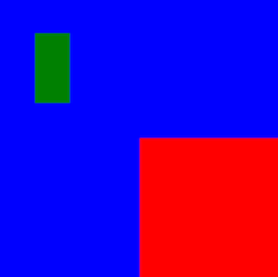

Today we're releasing React Native 0.74! This release adds Yoga 3.0, Bridgeless by default under the New Architecture, batched `onLayout` updates (New Architecture), and Yarn 3 as the default package manager for new projects.

We are also removing deprecated APIs, with the removal of `PropTypes` and breaking changes to `PushNotificationIOS`. On Android, SDK 23 (Android 6.0) is now the minimum supported version.

### Highlights

- [Yoga 3.0](/blog/2024/04/22/release-0.74#yoga-30)
- [New Architecture: Bridgeless by Default](/blog/2024/04/22/release-0.74#new-architecture-bridgeless-by-default)
- [New Architecture: Batched `onLayout` Updates](/blog/2024/04/22/release-0.74#new-architecture-batched-onlayout-updates)
- [Yarn 3 for New Projects](/blog/2024/04/22/release-0.74#yarn-3-for-new-projects)

### Breaking Changes

- [Android Minimum SDK Bump (Android 6.0)](/blog/2024/04/22/release-0.74#android-minimum-sdk-bump-android-60)
- [API Changes to PushNotificationIOS (Deprecated)](/blog/2024/04/22/release-0.74#api-changes-to-pushnotificationios-deprecated)
- [Removal of Deprecated `PropTypes`](/blog/2024/04/22/release-0.74#removal-of-deprecated-proptypes)
- [Removal of Flipper React Native Plugin](/blog/2024/04/22/release-0.74#removal-of-flipper-react-native-plugin)
- [Other Breaking Changes](/blog/2024/04/22/release-0.74#other-breaking-changes)

<!--truncate-->

## Highlights

### Yoga 3.0

#### New Layout Behaviors

React Native 0.74 includes [Yoga 3.0](https://yogalayout.dev/blog/announcing-yoga-3.0), the newest version of our layout engine. Yoga 3.0 improves layout by making styling more predictable, and supports rendering components written for the web.

React Native continues to intentionally preserve some incorrect layout behaviors, where fixing them was found to effect a significant number of real-world components. Layout conformance will be able to be configured more granularly in future versions of React Native.

:::warning

React Native [previously flipped](https://yogalayout.dev/blog/announcing-yoga-3.0#correct-handling-of-logical-edges-in-row-reverse-containers) `left`/`right` (and `start`/`end`) edges when dealing with `margin`, `padding`, or `border`, set on a `row-reverse` container. Now, behavior of these properties lines up with web. Code which previously relied on edges being inverted may need to be updated to continue rendering correctly.

<table>
<tr>
  <th>Style</th>
  <th>Before</th>
  <th>After</th>
</tr>
<tr>
<td width="350">

```jsx
<View
  style={{
    flexDirection: 'row',
    backgroundColor: 'red',
    margin: 10,
    width: 200,
    height: 100,
  }}>
  <View
    style={{
      flexDirection: 'row-reverse',
      backgroundColor: 'blue',
      flex: 1,
      marginLeft: 50,
    }}>
    <View
      style={{
        backgroundColor: 'green',
        height: '50%',
        flex: 1,
        marginLeft: 50,
      }}
    />
  </View>
</View>
```

</td>
<td>


</td>
<td>


</td>
</tr>
</table>

:::

#### Support for `align-content: 'space-evenly'`

Yoga 3.0 brings support for [`alignContent: 'space-evenly'`](https://developer.mozilla.org/en-US/docs/Web/CSS/align-content#space-evenly). `space-evenly` distributes the lines in a multi-line flex container using evenly spaced gaps, placed between line and container edges.

<figure>
  
  <figcaption><small>Source: [World Wide Web Consortium](https://www.w3.org/TR/css-align-3/#distribution-values)</small></figcaption>
</figure>

#### Support for `position: 'static'`

:::info
`position: 'static'` is supported only in the New Architecture.
:::

Elements marked as [`position: 'static'`](https://developer.mozilla.org/en-US/docs/Web/CSS/position#static) may not be offset, and are not considered when determining the [containing block](https://developer.mozilla.org/en-US/docs/Web/CSS/Containing_block) of an absolutely positioned element. This allows positioning an element relative to an ancestor which is not its direct parent.

<table>
<tr>
<td width="350">

```jsx
<View
  style={{
    backgroundColor: 'blue',
    width: 200,
    height: 200,
    flexDirection: 'row-reverse',
  }}>
  <View
    style={{
      backgroundColor: 'red',
      width: 100,
      height: 100,
      position: 'static',
    }}>
    <View
      style={{
        backgroundColor: 'green',
        width: 25,
        height: '25%',
        left: 25,
        top: 25,
        position: 'absolute',
      }}
    />
  </View>
</View>
```

</td>
<td width="300">



</td>
</tr>
</table>

Notice how the green `<View>` declares `left` and `top` and it is positioned relative to the blue `<View>`, not its parent.

React Native continues to default to `position: 'relative'` when no `position` is set.

### New Architecture: Bridgeless by Default

In this release, we are making Bridgeless Mode the default when the New Architecture is enabled. You can learn more about our switch to Bridgeless as the default in [this post](https://github.com/reactwg/react-native-new-architecture/discussions/174). To make the transition smoother we enhanced the interop layers to cover Bridgeless and worked with several libraries to make sure they will work in Bridgeless from day one.

Bridgeless is not the only interop layer we worked on: we improved the New Renderer Interop layers too. The most exciting bit is that it is now enabled by default: you don't need to specify the components that have to go through it! You can read more about them [here](https://github.com/reactwg/react-native-new-architecture/discussions/175).

Finally, if you want to learn more about the New Architecture, you can find documentation in the [react-native-new-architecture](https://github.com/reactwg/react-native-new-architecture/tree/main/docs) repo. When the New Architecture becomes the default, this information will be incorporated into [reactnative.dev](https://reactnative.dev).

### New Architecture: Batched `onLayout` updates

State updates in `onLayout` callbacks are now batched. Previously, each state update in the `onLayout` event would result in a new render commit.

```jsx
function MyComponent(props) {
  const [state1, setState1] = useState(false);
  const [state2, setState2] = useState(false);

  return (
    <View>
      <View
        onLayout={() => {
          setState1(true);
       }}>
      <View
         onLayout={() => {
          // When this event is executed, state1's new value is no longer observable here.
          setState2(true);
        }}>
      </View>
    </View>
  );
}
```

In 0.74, `setState1` and `setState2` updates are batched together. This change is [expected behavior in React](https://react.dev/learn/queueing-a-series-of-state-updates#react-batches-state-updates) and allows for less re-renders.

:::danger
This change **may break code** that has relied on un-batched state updates. You'll need to refactor this code to use [updater functions](https://react.dev/learn/queueing-a-series-of-state-updates#updating-the-same-state-multiple-times-before-the-next-render) or equivalent.
:::

### Yarn 3 for New Projects

[Yarn 3](https://yarnpkg.com/blog/release/3.0) is now the default JavaScript package manager for new projects initialized with React Native Community CLI.

Yarn 3.x will be used with `nodeLinker: node-modules`, a mode providing compatibility with React Native libraries. This replaces Yarn Classic (1.x, deprecated) as the previous default. To upgrade Yarn version inside your existing app you can follow this [guide](https://yarnpkg.com/migration/guide).

```sh
$ yarn --help
━━━ Yarn Package Manager - 3.6.4 ━━━━━━━━━━━━━━━━━━━━━━━━━━━━━━━━━━━━━━━━━━━━━━━━

  $ yarn <command>
```

The Community CLI also supports initializing projects with other package managers via the `--pm` flag ([read more](https://github.com/react-native-community/cli/blob/main/docs/init.md)).

## Breaking Changes

### Android Minimum SDK Bump (Android 6.0)

React Native 0.74 has a minimum Android SDK version requirement of 23 (Android 6.0). Previously, this was Android 5.0 (API 21). See our context for this change [here](https://github.com/react-native-community/discussions-and-proposals/discussions/740).

#### Bonus: Android app size reduction

The minimum SDK bump, together with several improvements at our native build, allowed us to greatly reduce the app size on user devices.

For example a newly created app with React Native 0.74 occupies ~13% less space on user device, resulting in ~4MB saved on device.


### Removal of Deprecated `PropTypes`

Before 0.74, React Native continued to ship with `PropTypes`, an API that has been deprecated since React 15.5 in 2017! We are now removing all built-in `PropTypes` from React Native, reducing app size (26.4kB in a minified bundle) and memory overhead.

The following `PropTypes` properties are removed: `Image.propTypes`, `Text.propTypes`, `TextInput.propTypes`, `ColorPropType`, `EdgeInsetsPropType`, `PointPropType`, `ViewPropTypes` (see [commit](https://github.com/facebook/react-native/commit/228cb80af9ded20107f3c7a30ffe00e24471bfeb)).

If your app or library relies on `PropTypes`, we highly recommend migrating to a type system like TypeScript.

### API Changes to PushNotificationIOS (Deprecated)

In React Native 0.74, we are making steps to remove the deprecated [PushNotificationIOS](https://reactnative.dev/docs/pushnotificationios) library. The changes in this release are focused on removing references to older iOS APIs. PushNotificationIOS has been migrated onto Apple’s [User Notifications](https://developer.apple.com/documentation/usernotifications?language=objc) framework and exposes new APIs for scheduling and handling notifications.

In the next release (0.75), we are planning to **remove this library**, relocating it out of React Native core and into the community package, [@react-native-community/push-notification-ios](https://github.com/react-native-push-notification/ios). If you are still relying on PushNotificationIOS, you’ll need to migrate over before the next release.

#### API Changes

The `didRegisterUserNotificationSettings:` callback on `RCTPushNotificationManager` was a no-op and has been deleted.

The following callbacks on `RCTPushNotificationManager` have been deprecated and will be removed in 0.75:

```objectivec
+ (void)didReceiveLocalNotification:(UILocalNotification *)notification;
+ (void)didReceiveRemoteNotification:(NSDictionary *)notification;
```

In order to retrieve the notification which launched the app using `getInitialNotification()`, you’ll now need to explicitly set the `initialNotification` on `RCTPushNotificationManager`:

```objectivec
[RCTPushNotificationManager setInitialNotification:response.notification];
```

On the JS side, properties on `Notification` have changed. `alertAction` and `repeatInterval` are now deprecated and will be removed in 0.75:

```js
type Notification = {
  ...
  // NEW: Seconds from now to display the notification.
  fireIntervalSeconds?: ?number,

  // CHANGED: Used only for scheduling notifications. Will be null when
  // retrieving notifications using `getScheduledLocalNotifications` or
  // `getDeliveredNotifications`.
  soundName?: ?string,

  // DEPRECATED: This was used for iOS's legacy UILocalNotification.
  alertAction?: ?string,

  // DEPRECATED: Use `fireDate` or `fireIntervalSeconds` instead.
  repeatInterval?: ?string,
};
```

Finally, the `handler` parameter on `PushNotificationIOS.removeEventListener` is unused and has been removed.

<details>
<summary>**💡 How to Migrate**</summary>

#### iOS

Your `AppDelegate` will need to implement `UNUserNotificationCenterDelegate`. This should be done on app startup in `application:willFinishLaunchingWithOptions:` or `application:didFinishLaunchingWithOptions:` (see [Apple Docs](https://developer.apple.com/documentation/usernotifications/unusernotificationcenterdelegate?language=objc) for more details).

```objectivec
- (BOOL)application:(UIApplication *)application didFinishLaunchingWithOptions:(NSDictionary *)launchOptions
{
  ...
  UNUserNotificationCenter *center = [UNUserNotificationCenter currentNotificationCenter];
  center.delegate = self;

  return YES;
}
```

Implement <code>[userNotificationCenter:willPresentNotification:withCompletionHandler:](https://developer.apple.com/documentation/usernotifications/unusernotificationcenterdelegate/1649518-usernotificationcenter?language=objc)</code>, which is called when a notification arrives and the app is in the <em>foreground</em>. Use the <code>completionHandler</code> to determine if the notification will be shown to the user and notify <code>RCTPushNotificationManager</code> accordingly:

```objectivec
- (void)userNotificationCenter:(UNUserNotificationCenter *)center
       willPresentNotification:(UNNotification *)notification
         withCompletionHandler:(void (^)(UNNotificationPresentationOptions options))completionHandler
{
  // This will trigger 'notification' and 'localNotification' events on PushNotificationIOS
  [RCTPushNotificationManager didReceiveNotification:notification];
  // Decide if and how the notification will be shown to the user
  completionHandler(UNNotificationPresentationOptionNone);
}
```

To handle when a notification is tapped, implement <code>[userNotificationCenter:didReceiveNotificationResponse:withCompletionHandler:](https://developer.apple.com/documentation/usernotifications/unusernotificationcenterdelegate/1649501-usernotificationcenter?language=objc)</code>. Note that if you set foreground notifications to be shown in <code>userNotificationCenter:willPresentNotification:withCompletionHandler:</code>, you should only notify <code>RCTPushNotificationManager</code> in one of these callbacks.

If the tapped notification resulted in app launch, call `setInitialNotification:`. If the notification was not previously handled by `userNotificationCenter:willPresentNotification:withCompletionHandler:`, call `didReceiveNotification:` as well:

```objectivec
- (void)  userNotificationCenter:(UNUserNotificationCenter *)center
  didReceiveNotificationResponse:(UNNotificationResponse *)response
           withCompletionHandler:(void (^)(void))completionHandler
{
  // This condition passes if the notification was tapped to launch the app
  if ([response.actionIdentifier isEqualToString:UNNotificationDefaultActionIdentifier]) {
  // Allow the notification to be retrieved on the JS side using getInitialNotification()
    [RCTPushNotificationManager setInitialNotification:response.notification];
  }
 // This will trigger 'notification' and 'localNotification' events on PushNotificationIOS
  [RCTPushNotificationManager didReceiveNotification:response.notification];
  completionHandler();
}
```

Finally, delete the following methods and adapt the logic into the callbacks above which will be called instead:

1. <code>[application:didReceiveLocalNotification:](https://developer.apple.com/documentation/uikit/uiapplicationdelegate/1622930-application?language=objc)</code> [deprecated]
2. <code>[application:didReceiveRemoteNotification:](https://developer.apple.com/documentation/uikit/uiapplicationdelegate/1623117-application?language=objc)</code> [deprecated]
3. <code>[application:didReceiveRemoteNotification:fetchCompletionHandler:](https://developer.apple.com/documentation/uikit/uiapplicationdelegate/1623013-application?language=objc)</code> [not deprecated, but is superseded by the <code>UNUserNotificationCenterDelegate</code> methods]

Delete any usages of <code>[application:didRegisterUserNotificationSettings:](https://developer.apple.com/documentation/uikit/uiapplicationdelegate/1623022-application?language=objc)</code> and <code>RCTPushNotificationManager</code>’s corresponding <code>didRegisterUserNotificationSettings:</code> as well.

**Example:** See the RNTester <code>[AppDelegate.mm](https://github.com/facebook/react-native/blob/main/packages/rn-tester/RNTester/AppDelegate.mm)</code>.

#### JS

1. Remove any references to `alertAction`.
2. Remove the `handler` argument on any calls to `removeEventListener`.
3. Replace any usages of `repeatInterval` by firing multiple notifications using `fireDate` or `fireIntervalSeconds` instead.
4. Note that `soundName` will be null when it is accessed on a `Notification` returned from `getScheduledLocalNotifications()` and `getDeliveredNotifications()`.

</details>

### Removal of Flipper React Native Plugin

Use of [Flipper](https://fbflipper.com/) for inspecting React Native layouts, network requests, and [other React Native plugin features](https://fbflipper.com/docs/features/react-native/), is now unsupported. In 0.74, we have removed the native Flipper libraries and setup code from new React Native projects. This means fewer dependencies and quicker local setup (see [original RFC](https://github.com/react-native-community/discussions-and-proposals/blob/main/proposals/0641-decoupling-flipper-from-react-native-core.md)).

The diff for removing Flipper in your app can be seen in the [Upgrade Helper](https://react-native-community.github.io/upgrade-helper/). If you want to preserve Flipper in an existing app, ignore the relevant diff lines.

<details>
<summary>**💡 To re-integrate Flipper**</summary>

Flipper can still be used as a standalone tool for debugging an Android or iOS app, and can be manually integrated by following the Flipper docs ([Android guide](https://fbflipper.com/docs/getting-started/android-native/), [iOS guide](https://fbflipper.com/docs/getting-started/ios-native/)).

We recommend that teams invest in switching to native debugging tooling in Android Studio and Xcode.

</details>

:::tip

#### Replacing Flipper

There are a number of dedicated debugging tools which replace Flipper features. For more information, we recommend reading the excellent [_Why you don't need Flipper in your React Native app_](https://shift.infinite.red/why-you-dont-need-flipper-in-your-react-native-app-and-how-to-get-by-without-it-3af461955109) article by Jamon Holmgren.

:::

#### JavaScript debugging

Using the [Hermes Debugger](https://reactnative.dev/docs/debugging?js-debugger=hermes#opening-the-debugger) remains our recommended debugging option for 0.74. You can also try the [Experimental New Debugger](https://reactnative.dev/docs/debugging?js-debugger=new-debugger#opening-the-debugger), which is also the default in Expo. This continues to be an early preview — known issues and updates can be followed [here](https://github.com/react-native-community/discussions-and-proposals/discussions/733).

### Other Breaking Changes

**General**

- Make `start`/`end` in styles always refer to writing direction ([#42251](https://github.com/facebook/react-native/pull/42251)).

**Android**

- Remove of `JSIModule*` from `FabricUIManagerProvider` ([#42059](https://github.com/facebook/react-native/pull/42059)).
  - This API was unused in open source — use [TurboModules](https://github.com/reactwg/react-native-new-architecture/blob/main/docs/turbo-modules.md) instead.
- Deprecate `UIManagerModule.showPopupMenu` and `UIManagerModule.dismissPopupMenu` ([#42441](https://github.com/facebook/react-native/pull/42441))
  - This API has been moved to the [`@react-native/popup-menu-android`](https://www.npmjs.com/package/@react-native/popup-menu-android) npm package and will be removed in 0.75.

**iOS**

- Delete `configFilename` and `configKey` arguments from iOS codegen CLI ([#41533](https://github.com/facebook/react-native/pull/41533)).
- Change how [`bundleURL`](https://github.com/facebook/react-native/blob/0.74-stable/packages/react-native/template/ios/HelloWorld/AppDelegate.mm#L22-L29) is handled ([#43994](https://github.com/facebook/react-native/pull/43994)).
  - Before, `bundleURL` was set when React Native was started in an instance variable and it was not possible to update it.
  - Now, [`bundleUrl` is a function](https://github.com/facebook/react-native/blob/0.74-stable/packages/react-native/template/ios/HelloWorld/AppDelegate.mm#L22-L29) which is re-evaluated when needed, enabling the use of a different URL across refreshes.
  - This change will affect your app only if you were changing the `bundleURL` variable after the app is started. In this case, move the logic that updates the variable to the [`bundleURL` function](https://github.com/facebook/react-native/blob/0.74-stable/packages/react-native/template/ios/HelloWorld/AppDelegate.mm#L22-L29) in `AppDelegate`.

Please see the [full changelog](https://github.com/facebook/react-native/blob/main/CHANGELOG.md) for a complete list of breaking changes.

## Known Issues

**iOS**

- Edge case when using multiple windows: When the main window is inactive and the system tries to present a dialog, the dialog is not presented in the right position on the screen. A fix is incoming in [#44167](https://github.com/facebook/react-native/pull/44167) and will ship in 0.74.1.

## Acknowledgements

React Native 0.74 contains over [1673 commits](https://github.com/facebook/react-native/compare/v0.73.6...v0.74.0) from 57 contributors. Thanks for all your hard work!

Thanks to all the additional authors that worked on documenting features in this release post:

- [Nick Gerleman](https://github.com/NickGerleman) for _Yoga 3.0_
- [Joe Vilches](https://github.com/joevilches) for _Yoga 3.0_
- [Riccardo Cipolleschi](https://twitter.com/CipolleschiR) for _New Architecture: Bridgeless by Default_
- [Samuel Susla](https://twitter.com/SamuelSusla) for _New Architecture: Batched `onLayout` updates_
- [Tim Yung](https://twitter.com/yungsters) for _Removal of Deprecated `PropTypes`_
- [Ingrid Wang](https://github.com/ingridwang) for _API Changes to PushNotificationIOS (Deprecated)_

## Upgrade to 0.74

Please use the [React Native Upgrade Helper](https://react-native-community.github.io/upgrade-helper/) to view code changes between React Native versions for existing projects, in addition to the [Upgrading docs](/docs/upgrading).

To create a new project:

```sh
npx react-native@latest init MyProject
```

If you use Expo, React Native 0.74 will be supported in Expo SDK 51.

:::info
0.74 is now the latest stable version of React Native and **0.71.x moves to unsupported**. For more information see [React Native's support policy](https://github.com/reactwg/react-native-releases#releases-support-policy). We aim to publish a final end-of-life update of 0.71 at the beginning of May.
:::
