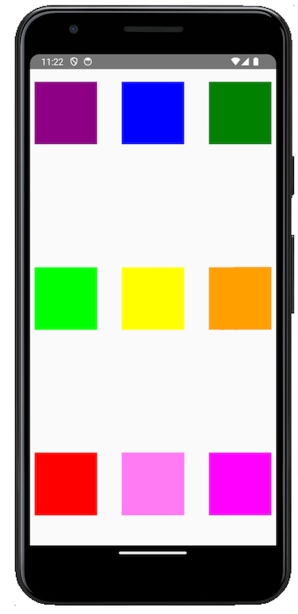
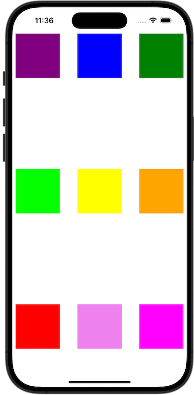
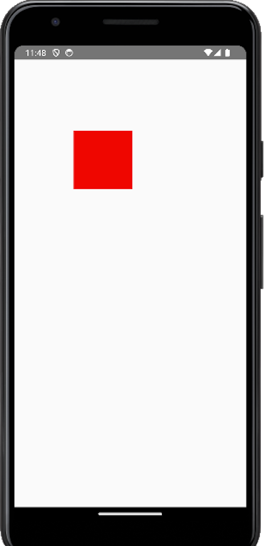
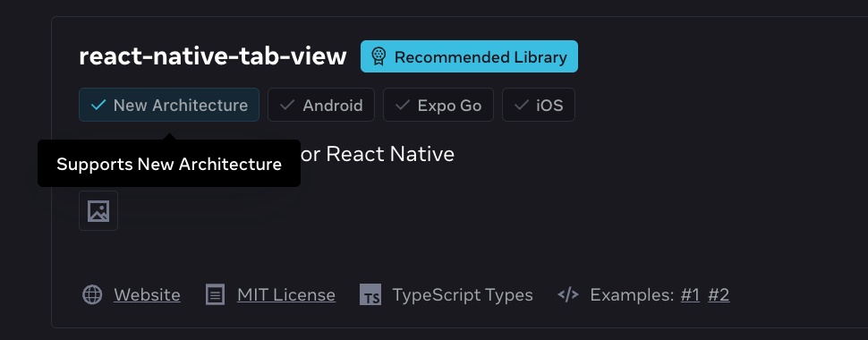
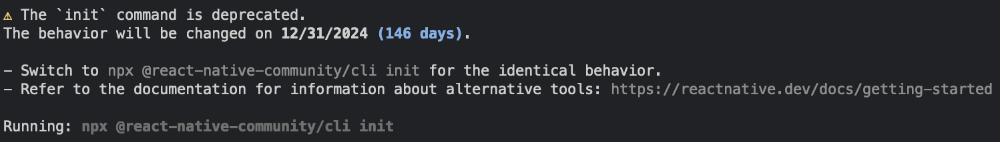

Today we are excited to release React Native 0.75!

This release ships several features, such as Yoga 3.1 with support for `%` values, several stabilization fixes for the New Architecture, and the introduction of the recommendation for users to use a React Native Framework.

### Highlights

- [Yoga 3.1 and Layout Improvements](/blog/2024/08/12/release-0.75#yoga-31-and-layout-improvements)
- [New Architecture Stabilization](/blog/2024/08/12/release-0.75#new-architecture-stabilization)
- [Using Frameworks](/blog/2024/08/12/release-0.75#using-frameworks)

### Breaking Changes

- [Touchables in TypeScript can’t be used as types in Generic expressions anymore](/blog/2024/08/12/release-0.75#touchables-in-typescript-cant-be-used-as-types-in-generic-expressions-anymore)
- [Last version supporting minSdk 23 and minIOSVersion 13.4](/blog/2024/08/12/release-0.75#last-version-supporting-minsdk-23-and-miniosversion-134)
- [Android: JSIModule has been deleted](/blog/2024/08/12/release-0.75#android-jsimodule-has-been-deleted)
- [Android: PopUp Menu removed from core](/blog/2024/08/12/release-0.75#android-popup-menu-moved-to-separate-package)
- [iOS: Finalized Push Notifications deprecation work](/blog/2024/08/12/release-0.75#ios-finalized-pushnotificationios-deprecation-work)
- [Community CLI: Removal of ram-bundle and profile-hermes commands](/blog/2024/08/12/release-0.75#community-cli-removal-of-ram-bundle-and-profile-hermes-commands)

<!--truncate-->

## Highlights

### Yoga 3.1 and Layout Improvements

Since we last shipped Yoga [version 3.0](https://reactnative.dev/blog/2024/04/22/release-0.74#yoga-30) in React Native 0.74, we kept on pushing many improvements and new layout capabilities for your applications. React Native 0.75 ships with Yoga 3.1 and you can learn more about what’s new in the official Yoga’s [release blog post](https://www.yogalayout.dev/blog/announcing-yoga-3.1).

One notable and highly requested feature is the support for `%` values in various places, such as `gaps` and `translation`

:::info
These features are available only for the New Architecture. If you are keen to use them, please consider migrating to it.
:::

#### Percentage Values in Gaps

With 0.75, the `gap`, `columnGap` and `rowGap` props described [here](https://reactnative.dev/docs/flexbox#row-gap-column-gap-and-gap) now support a string with a `%` value.

For example:

```tsx
function App(): React.JSX.Element {
  return (
    <SafeAreaView
      style={{
        marginTop: 20,
        alignItems: 'center',
        flex: 1,
        rowGap: '20%',
      }}>
      <View
        style={{flex: 1, flexDirection: 'row', columnGap: '10%'}}>
        <View
          style={{
            backgroundColor: 'purple',
            width: 100,
            height: 100,
          }}
        />
        <View
          style={{
            backgroundColor: 'blue',
            width: 100,
            height: 100,
          }}
        />
        <View
          style={{
            backgroundColor: 'green',
            width: 100,
            height: 100,
          }}
        />
      </View>
      <View
        style={{flex: 1, flexDirection: 'row', columnGap: '10%'}}>
        <View
          style={{
            backgroundColor: 'lime',
            width: 100,
            height: 100,
          }}
        />
        <View
          style={{
            backgroundColor: 'yellow',
            width: 100,
            height: 100,
          }}
        />
        <View
          style={{
            backgroundColor: 'orange',
            width: 100,
            height: 100,
          }}
        />
      </View>
      <View
        style={{flex: 1, flexDirection: 'row', columnGap: '10%'}}>
        <View
          style={{
            backgroundColor: 'red',
            width: 100,
            height: 100,
          }}
        />
        <View
          style={{
            backgroundColor: 'violet',
            width: 100,
            height: 100,
          }}
        />
        <View
          style={{
            backgroundColor: 'magenta',
            width: 100,
            height: 100,
          }}
        />
      </View>
    </SafeAreaView>
  );
}
```

Will be rendered as follows:

| Android                                                      | iOS                                                  |
| ------------------------------------------------------------ | ---------------------------------------------------- |
|  |  |

#### Percentage values in Translation

The [`transform` prop](https://reactnative.dev/docs/transforms) can also now accept `%` as values for the `translate` transformations.

For example, the following component would move the red square’s X coordinate by 100% of its width and the Y coordinate by 100% of its height:

```tsx
function Translated() {
  return (
    <SafeAreaView
      style={{
        marginTop: 20,
        flex: 1,
        rowGap: '20%',
      }}>
      <View
        style={{
          backgroundColor: 'red',
          width: 100,
          height: 100,
          transform: [{translateY: '100%'}, {translateX: '100%'}],
        }}
      />
    </SafeAreaView>
  );
}
```

Will be rendered as follows:

| Android                                                                     | iOS                                                                |
| --------------------------------------------------------------------------- | ------------------------------------------------------------------ |
|  |  |

### New Architecture Stabilization

Since our announcement of the [New Architecture being in Beta](https://github.com/reactwg/react-native-new-architecture/discussions/189) at React Conf, we shipped several bug fixes and improvements to its stability.

Our goal is for the New Architecture to be considered stable in the near future. Therefore, in the last few months we focused on bridging the gaps between the Old and the New Architecture. Some examples of bugs and missing features we fixed are:

- Fix `adjustsFontSizeToFit` on Android ([#44075](https://github.com/facebook/react-native/pull/44075))
- Fix `textAlign` not working with inline views on Android ([#44146](https://github.com/facebook/react-native/pull/44146))
- Fix text baseline being moved up on iOS ([#44932](https://github.com/facebook/react-native/pull/44932))

Together with the folks at Expo, we also worked on adding information about New Architecture support in the [React Native Directory](https://reactnative.directory/), so it will be immediately clear for you if a library already supports the New Architecture or not:



We also invite you to take part in the [New Architecture survey](https://t.co/ucAA58hnFu). This survey is key for us to collect precious feedback on the next steps for the New Architecture rollout.

We also want to share a post we published in the New Architecture Working Group about [Supporting UIManager in the New Architecture](https://github.com/reactwg/react-native-new-architecture/discussions/201). This post offers an API overview of the `UIManager` API on Android and how it can help the migration of more advanced apps & libraries.

This release contains also a new API which is now the blessed way to access the `jsi::Runtime`.

#### Accessing `jsi::Runtime` in TurboModules

In the past, there has never been a recommended way from native modules to access the `jsi::Runtime`, and consumers would work around the framework to do so in risky ways. In 0.74, we introduced experimental APIs providing safe access to the `jsi::Runtime`, and we’re happy to announce their stability for 0.75.

<details>
<summary>Examples on how to access the jsi::Runtime</summary>

On iOS, you can make your Turbo Native Module conform to the protocol `RCTTurboModuleWithJSIBindings`. You can now implement `installJSIBindingsWithRuntime`, which will give you thread-safe access to the runtime.

```objc
@interface RCTSampleTurbo Module () <RCTTurboModuleWithJSIBindings>
@end

#pragma mark - RCTTurboModuleWithJSIBindings
- (void)installJSIBindingsWithRuntime:(jsi::Runtime &)runtime {
  runtime.global().setProperty(
    runtime,
    "myGlobalFunction",
    jsi:: Function::createFromHost Function(...));
}
```

On Android, you can make your Turbo Native Module conform to the interface `TurboModuleWithBindings`. You can now implement the JNI method `getBindingsInstaller`, which will give you thread-safe access to the runtime in C++.

```java
public class SampleTurboModule extends NativeSampleTurboModuleSpec implements TurboModuleWithJSIBindings

@Override
public native BindingsInstallerHolder getBindingsInstaller();
```

```cpp
// C++
jni::local_ref<BindingsInstallerHolder::javaobject> SampleTurboModuleJSIBindings::getBindingsInstaller(jni::alias_ref<jni::object> jobj) {
  return BindingsInstallerHolder::newObjectCxxArgs(
    [](jsi::Runtime& runtime) {
      runtime.global().setProperty(
        runtime,
        “myGlobalFunction”,
        jsi::Function::createFromHostFunction(...));
    }
  );
}
```

If you’re on the UI thread and you need to access the runtime, we introduced a new API: `CallInvoker`. It consists of a single method, `invokeAsync`, that will jump onto the JS thread to safely execute some work using the JS runtime. These APIs are forward compatible.

On iOS, we’ve provided the protocol `RCTCallInvokerModule`. After conforming to this protocol, our infrastructure will decorate the module with access to the `CallInvoker`.

```objc
@interface RCTSampleTurboModule() <RCTCallInvokerModule>

[self.callInvoker callInvoker].invokeAsync([&](jsi::Runtime& runtime) {
  // do stuff on JS thread
}
```

On Android, the `CallInvoker` is accessible through the `ReactContext` in a JNI wrapper called `CallInvokerHolder`, where you can then call `invokeAsync` after crossing the JNI boundary.

```java
// Java
public abstract CallInvokerHolder getJSCallInvokerHolder();
```

```cpp
// C++
jsCallInvokerHolder->cthis()->getCallInvoker()->invokeAsync([&](jsi::Runtime& rt) {
  // do stuff on JS thread
});
```

</details>

### Using Frameworks

As we shared at React Conf earlier this year, the recommended way to build a React Native app is now through a framework, such as Expo.

You can read more about this guidance on our previous blog-post: "[Use a framework to build React Native apps](https://reactnative.dev/blog/2024/06/25/use-a-framework-to-build-react-native-apps)".

We want to set up new React Native users for success. We believe that using a framework makes you as productive as possible, and offers you the best developer experience when building new apps.

To reflect those recommendations, this version includes the following changes:

- We moved the `/template` folder from the `react-native` package to a separate repository: [`react-native-community/template`](https://github.com/react-native-community/template).
- We’re sunsetting the `react-native init` command as of December 31st 2024.

If you’re already using a framework such as Expo, those changes won’t impact you at all. You’ll be able to use React Native 0.75 together with Expo SDK 51 (you can find instructions on how to do it in [this dedicated Expo post](https://expo.dev/changelog/2024/08-14-react-native-0.75)).

If you’re not using a framework or you’re building your own framework, let’s see how those changes will impact you.

#### Moving the template to react-native-community/template

Historically, `react-native` used to ship a `/template` folder inside the NPM package which was used by the Community CLI to create new projects. This made updating the template quite slow as we needed a new React Native release for every template change.

With our latest recommendation to use a framework, we feel that shipping an opinionated template inside our core NPM package was not aligned with [our vision](https://github.com/react-native-community/discussions-and-proposals/blob/main/proposals/0759-react-native-frameworks.md).

Therefore, we decided to move the template to the [`@react-native-community/template`](https://www.npmjs.com/package/@react-native-community/template) package.

This will make it easier for the community to maintain and evolve the template, without having to rely on a React Native release for every change. Moreover, this brings the template closer to the Community CLI and will make it easier for everyone to inspect and depend on the template as a separate package.

This change should be completely transparent to users who create new projects using the Community CLI. From now on, new issues related to the template should be reported on the [template issue tracker](https://github.com/react-native-community/template/issues?q=sort%3Aupdated-desc+is%3Aissue+is%3Aopen). All the various tools that depend on the template, such as the upgrade-helper, have also been updated accordingly and will continue working as usual.

#### Sunsetting react-native init

Similarly to the template, the `react-native init` command was also adapted to align with the new recommendation.

Historically, `react-native init` was the default command to create new React Native projects. However, in 2024, we feel this command does not provide the same onboarding experience that a framework would offer you. That is why we are not recommending it anymore, instead you should use a framework like Expo.

You can still use `react-native init` to create new projects using the Community CLI & template today, but you will see the following warning:



Starting from December 31st 2024, the `init` command won’t create a project anymore. You will have to either:

- Use a framework such as Expo, with its own dedicate command to create a new project, such as `npx create-expo-app`
- Invoke the Community CLI directly with `npx @react-native-community/cli init`

Please note that `react-native config` and all the other commands than `init` will continue working as usual.

:::info
In order to offer a smoother migration experience, the `react-native@0.75.0` package is still depending on `@react-native-community/cli` but we’re planning on removing this dependency in the near future.
:::

#### Auto-linking performance improvements

During this work in updating the `init` command, we also spent time rewriting the auto-linking logic to be more performant. This results in faster build speed for both Android and iOS.

With React Native 0.75, if you are using Expo, the auto-linking step could now run ~6.5x faster on Android and ~1.5x faster on iOS. You can read more about these improvements [here](https://github.com/react-native-community/discussions-and-proposals/discussions/814).

### Breaking changes

While this upcoming section seems lengthy, we expect that the breaking changes here will mostly impact a small group of users that are using React Native in more advanced ways.

We want to present them here for the sake of completeness and for reference.

#### Touchables in TypeScript can’t be used as types in Generic expressions anymore

`TouchablesOpacity` and `TouchableHighlights` components have been converted to functional components. This means that they cannot be used as `value & type` anymore. So, for example, the following is not valid anymore:

```tsx
import {TouchableHighlight} from 'react-native';
const ref = useRef<TouchableHighlight>();
//                ^^^ TS2749: TouchableHighlight refers to a value, but is being used as a type here.
//                            Did you mean typeof TouchableHighlight?
```

Instead, you should use the built-in React type `React.ElementRef` or, alternatively, the `View` type:

```tsx
import {TouchableHighlight} from 'react-native';
const ref1 =
  useRef<React.ElementRef<typeof TouchableHighlight>>();
// or
const ref2 = useRef<View>();
```

#### Last version supporting minSdk 23 and minIOSVersion 13.4

These are not breaking changes in 0.75 _per se_, but we want to share that React Native 0.75 will be the last version of React Native to support minSdk 23 (Android 6.0) and minIOSVersion 13.4.

Starting from React Native 0.76, the minSdk version will be 24 (Android 7.0) and the minIOSVersion will be 15.1.

You can read more about it in our official announcement [for Android](https://github.com/react-native-community/discussions-and-proposals/discussions/802) and [for iOS](https://github.com/react-native-community/discussions-and-proposals/discussions/812).

#### Android: JSIModule has been deleted

The `com.facebook.react.bridge.JSIModule` ([source](https://github.com/facebook/react-native/blob/0.73-stable/packages/react-native/ReactAndroid/src/main/java/com/facebook/react/bridge/JSIModule.java)) was an API that we temporarily introduced to allow a Native Module to access JSI directly on Android.
The accessors for this API [were deprecated in 0.74](https://reactnative.dev/blog/2024/04/22/release-0.74#other-breaking-changes), and we verified that there was no meaningful usage of this API in Open Source so we’re removing it in 0.75.
You can use [Turbo Native Modules](https://github.com/reactwg/react-native-new-architecture/blob/main/docs/turbo-modules.md) instead as an alternative.

#### Android: PopUp Menu moved to separate package

In 0.74, [we moved the Android’s `PopUpMenu` to a separate package](https://reactnative.dev/blog/2024/04/22/release-0.74#other-breaking-changes) under the `@react-native` scope.
In 0.75, we are removing the remaining methods that were still in core:

- `UIManagerModule.showPopupMenu()`
- `UIManagerModule.dismissPopupMenu()`

As an alternative, please use the please use the `<PopupMenuAndroid />` component, which lives in the [`@react-native/popup-menu-android`](https://www.npmjs.com/search?q=%40react-native%2Fpopup-menu-android) package.

#### iOS: Finalized PushNotificationIOS deprecation work

In 0.74, we [deprecated](https://reactnative.dev/blog/2024/04/22/release-0.74#api-changes-to-pushnotificationios-deprecated) some APIs from the `PushNotificationIOS` module.

In 0.75, we’ve deleted these APIs to migrate off legacy representations of notifications metadata.

The APIs that have been deleted are:

```objc
  + (void)didReceiveLocalNotification:(UILocalNotification *)notification;
  + (void)didReceiveRemoteNotification:(NSDictionary *)notification;
```

Instead, use `didReceiveNotification:(UNNotification *)notification`.

#### Community CLI: Removal of ram-bundle and profile-hermes commands

We would like to announce two significant removals coming from the Community CLI: the commands `ram-bundle` and `profile-hermes`.

The `ram-bundle` command was introduced in React Native 0.59 to let you run your bundles by loading them directly in memory. This functionality is now superseded by Hermes, our default JS engine. You should not use the `ram-bundle` command.

The `profile-hermes` command was a tool to help you profile the CPU performance of your JavaScript code. This used the old `.cpuprofile` format, which is no longer supported in recent versions of Chrome. Including this capability as a standalone command is also something we are moving away from as we work on raising the quality bar of our debugging tools. CPU profiling can now be accessed from the "Profiler" panel in the [Experimental New Debugger](https://reactnative.dev/docs/0.74/debugging?js-debugger=new-debugger#opening-the-debugger) (Note: this is not accessible if connecting to Hermes from Chrome).

## Other Breaking changes

### General

- **Codegen**
  - Changed slightly the name of pure C++ TurboModules generated classes and structs. We dropped the `Cxx` token from their names
  - Float enums are not supported anymore due to possible precision errors
  - Throw an error when passing `null` in JS to a non nullable argument in Native
- **Linting**
  - ESLint config no longer run prettier when linting
- **C++**
  - `ScrollViewShadowNode` now requires a new `bool includeTransform` parameter in the constructor
  - Removed `executeAsynchronously` and `executeSynchronously_CAN_DEADLOCK` from RuntimeExecutor
  - Renamed `JsErrorHandlingFunc` to `OnJsError` in `JsErrorHandler.h`
  - Renamed `handleJsError` to `OnJsError` in `handleFatalError.h`
  - Removed unused `import` from `ReactPrimitives.h`
  - `LongLivedObjectCollection` and `LongLivedObject` get methods now accepts a Runtime parameter
  - Renamed the `utils/jsi.h` file to `jsi-utils.h`
- **TextInput**
  - Removed deprecated `onTextInput` callback
- **Pressability**
  - Removed `onLongPressShouldCancelPress_DEPRECATED`, `onResponderTerminationRequest_DEPRECATED`, and `onStartShouldSetResponder_DEPRECATED` method

#### Android

- **ReactViewBackgroundDrawable**
  - Deprecated in favor of `CSSBackgroundDrawable`. This also remove some APIs from `ReactViewBackgroundDrawable` and from `ColorUtil`
- **ReactContext**
  - `ReactContext` and `ReactApplicationContext` are now abstract. Use `BridgeReactContext` and `BridgelessReactContext` instead
  - Delete `ReactContext.initializeWithInstance()`. Please use `BridgeReactInstance` instead
  - Remove `BridgelessReactContext.getJavaScriptContextHolder()` from. Please use `BridgelessCatalystInstance` instead
  - Remove `ReactContext.getRuntimeExecutor()`. Please use `BridgelessCatalystInstance`
- **Layout**
  - Support percentage flex gap values. This changes the parameters of some methods like `setGap`, `setRowGap` and `setColumnGap` from float to dynamic
  - Requires `supportsRTL` in Android Manifest
- **Runtime**
  - Removed `ReactJsExceptionHandler` from ReactHostImpl
  - Make the app responsible to return the core turbomodules when not using the default template
- **DevSupport**
  - Changed the `DevSupportManagerFactory.create()` to accept a new `PausedInDebuggerOverlayManager` parameter
- **Measurement**
  - Deleted `UIManagerModule.measureLayoutRelativeToParent()`

#### iOS

- **Runtime**
  - Remove `[RCTHost getSurfacePresenter]` and `[RCTHost getModuleRegistry]`
  - Remove `EventPriority` class and always use the default `EventPriority::AsynchronousBatched`. If build fails, please remove any use of `EventPriority`
- **Image**
  - Remove unused `RCTImageLoadingPerfInstrumentationEnabled`
- **Error Handling**
  - Remove `RCTRedBox` access through `RCTBridge`
- **CocoaPods**
  - Renamed `BUILD_FROM_SOURCE` to `RCT_BUILD_HERMES_FROM_SOURCE`
  - Renamed `React-Codegen` to `ReactCodegen` for better compatibility with `use_frameworks` and Swift
- **TextInput**
  - Remove deprecated `onTextInput` callback

### Acknowledgements

React Native 0.75 contains over **1491 commits** from **165 contributors**. Thanks for all your hard work!

Thanks to all the additional authors that worked on documenting features in this release post:

- [Nick Gerleman](https://github.com/NickGerleman) and [Joe Vilches](https://github.com/joevilches) for _Yoga 3.1 and Layout Improvements_
- [Arushi Kesarwani](https://github.com/arushikesarwani94) for Supporting UIManager in the New Architecture
- [Phillip Pan](https://github.com/philIip) for Accessing jsi::Runtime in TurboModules
- [Alan Lee](https://github.com/alanleedev) and [Soe Lynn](https://github.com/realsoelynn) for Last version supporting minSdk 23 and minIOSVersion 13.4
- [Kudo Chien](https://github.com/kudo) for Auto-linking performance improvements
- [Alex Hunt](https://github.com/huntie) for Removal of `ram-bundle` and `profile-hermes` commands

### Upgrade to 0.75

Please use the [React Native Upgrade Helper](https://react-native-community.github.io/upgrade-helper/) to view code changes between React Native versions for existing projects, in addition to the Upgrading docs.

To create a new project:

```bash
npx @react-native-community/cli@latest init MyProject --version latest
```

If you use Expo, React Native 0.75 will be supported in Expo SDK 51 (instructions on how to updated React Native inside your Expo project to 0.75.0 are available [in this dedicated post](https://expo.dev/changelog/2024/08-14-react-native-0.75)).

:::info
0.75 is now the latest stable version of React Native and 0.72.x moves to unsupported. For more information see [React Native's support policy](https://github.com/reactwg/react-native-releases/blob/main/docs/support.md). We aim to publish a final end-of-life update of 0.72 in the near future.
:::
