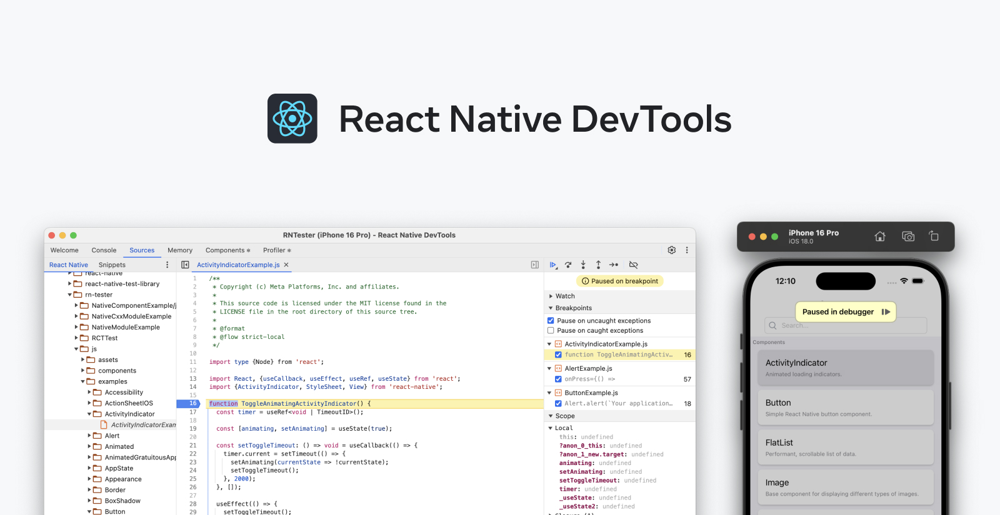
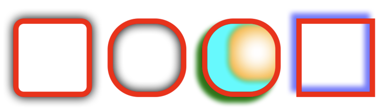

Today we are excited to release React Native 0.76!

This is a major milestone for React Native, as we’re enabling the New Architecture by default, and we’re introducing React Native DevTools. This has been the culmination of 6 years of hard work from our team, together with the support of our incredible community of developers.

### Highlights

- [React Native New Architecture by default](/blog/2024/10/23/release-0.76-new-architecture#react-native-new-architecture-by-default)
- [React Native DevTools](/blog/2024/10/23/release-0.76-new-architecture#react-native-devtools)
- [Faster Metro resolution](#faster-metro-resolution)
- [Box Shadow and Filter style props](/blog/2024/10/23/release-0.76-new-architecture#box-shadow-and-filter-style-props)

### Breaking Changes

- [Removed the dependency on the react-native-community/cli](/blog/2024/10/23/release-0.76-new-architecture#removed-the-dependency-on-the-react-native-communitycli)
- [Android Apps are ~3.8Mb smaller thanks to Native Library merging](/blog/2024/10/23/release-0.76-new-architecture#android-apps-are-38mb-smaller-thanks-to-native-library-merging)
- [Updates to Minimum iOS and Android SDK requirements](/blog/2024/10/23/release-0.76-new-architecture#updates-to-minimum-ios-and-android-sdk-requirements)

<!--truncate-->

## Highlights

### React Native New Architecture by default

Starting from React Native 0.76, the New Architecture is enabled by default in your projects. The New Architecture is a rewrite of the internals of React Native to enable app developers to develop high quality native applications using React.

Today, we’re excited to declare the New Architecture ready for production use.

This change is a milestone in the evolution of React Native, and we invite you to read the dedicated blogpost to understand what's included in the New Architecture and how it will shape the future of React Native: [The New Architecture is Here](/blog/2024/10/23/the-new-architecture-is-here).

### React Native DevTools



We're releasing the first stable version of React Native DevTools, our new default debugging experience.

We want the tooling you use to debug React across all platforms to be reliable, familiar, simple, and cohesive. React Native DevTools delivers on these principles — browser-aligned developer tools that are deeply integrated with React Native. Key features include:

- **Familiar, web-aligned tooling** — A fully featured debugger based on Chrome DevTools with reliable breakpoints, watch values, step-through debugging, stack inspection, and a rich JavaScript console. These core features now work reliably and across reloads.
- **Improved and integrated React DevTools** — The built-in React Components Inspector and Profiler work seamlessly, with faster and more reliable component highlighting.
- **Improved UX** — See a new _Paused in Debugger_ overlay, making it clear when your app is paused on a breakpoint. Warnings in LogBox are now displayed as a summary, and hidden when DevTools is attached.
- **Fixed reconnection behaviour** — JavaScript breakpoints now work reliably across reloads and when DevTools is disconnected and reattached. DevTools can even reconnect to the same app after a native rebuild.
- **Instant launch** — React Native DevTools is ready by default with zero config. Open it from the in-app Dev Menu or via <kbd>j</kbd> to debug in the CLI server, which now supports multiple emulators and devices.

React Native DevTools is fundamentally different from our previous debugging options, including being different from the Experimental Debugger experience first shipped in 0.73. It switches to a new backend debugging stack that we’ve rebuilt over the last year. This means that compatibility with previous tooling [has changed](https://github.com/react-native-community/discussions-and-proposals/discussions/819#:~:text=announcement%20talk%20%F0%9F%8E%AC.-,Compatibility,-React%20Native%20DevTools), and you should also expect a much more reliable experience end-to-end. We intend to build upon this new stack to allow us to reliably implement more features in future, such as the Performance and Network panels.

#### Phasing out logs in Metro

In our next release, we're removing forwarded logs in Metro to align with modern browser tooling, and remove old debugging integrations. Instead, use React Native DevTools' fully featured Console panel for logging. See more under our [FAQs](https://github.com/react-native-community/discussions-and-proposals/discussions/819#:~:text=point%20is%20deprecated.-,FAQs,-React%20Native%20DevTools).

**Links**

- [Updated debugging docs](/docs/debugging)
- [Announcement talk at React Universe Conf](https://www.youtube.com/watch?v=OwivVpg6Luc)
- [Feedback thread and FAQs](https://github.com/react-native-community/discussions-and-proposals/discussions/819)

### Faster Metro resolution

We've shipped several performance improvements to Metro's resolver, the component responsible for finding a module from an import path, making it around [15x faster](https://x.com/MetroBundler/status/1831709057670861260). This improves the overall performance of Metro, particularly for warm builds, which we've seen at around 4x faster.

<div class="tweet">
    <iframe style={{ "border": "none" }} scrolling="no" width="550" height="870" data-tweet-url="https://twitter.com/MetroBundler/status/1831709057670861260" src="data:text/html;charset=utf-8,%3Cblockquote%20class%3D%22twitter-tweet%22%3E%3Cp%20lang%3D%22en%22%20dir%3D%22ltr%22%3EFaster%20resolution%2C%20faster%20builds%3Cbr%3E%3Cbr%3EYesterday%26%2339%3Bs%20Metro%20release%20included%20a%20bunch%20of%20performance%20improvements%20to%20our%20resolver%2C%20making%20it%20around%2015x%20faster.%20That%26%2339%3Bs%20especially%20good%20news%20for%20warm%20builds.%20%3Ca%20href%3D%22https%3A//t.co/huPD5CW5bu%22%3Epic.twitter.com/huPD5CW5bu%3C/a%3E%3C/p%3E%26mdash%3B%20Metro%20%28@MetroBundler%29%20%3Ca%20href%3D%22https%3A//twitter.com/MetroBundler/status/1831709057670861260%3Fref_src%3Dtwsrc%255Etfw%22%3ESeptember%205%2C%202024%3C/a%3E%3C/blockquote%3E%0A%3Cscript%20async%20src%3D%22https%3A//platform.twitter.com/widgets.js%22%20charset%3D%22utf-8%22%3E%3C/script%3E%0A%0A"></iframe>
</div>

### Box Shadow and Filter style props

We’ve added two New Architecture only style props in 0.76 - `boxShadow` and `filter`. Both of these props exist on the web, and the team stick to the specs when possible so that these props are predictable, familiar, and ultimately easier to adopt (see the limitations and spec deviations sections for the exceptions).
As a result, you can look up the web documentation to fully understand how these work, but there are a few important differences which are noted below.

#### `boxShadow`

`boxShadow` adds a shadow to an element, with the ability to control the position, color, size, and blurriness of the shadow. Check out the [MDN documentation](https://developer.mozilla.org/en-US/docs/Web/CSS/box-shadow) for a full overview of each of these arguments, along with a fiddle to try them out for yourself. Below are a few examples of the shadows you can make.



`boxShadow` can take either a string, which mimics the CSS syntax, or JS objects which can embed variables. For example the string `‘5 5 5 0 rgba(255, 0, 0, 0.5)’` and the object `{offsetX: 5, offsetY: 5, blurRadius: 5, spreadDistance: 0, color: ‘rgba(255, 0, 0, 0.5)’}` would yield the same box shadow.

The [previous shadow functionality](https://reactnative.dev/docs/shadow-props) had some shortcomings addressed now addressed by `boxShadow`:

- Does not work on Android
- Cannot be [inset](https://developer.mozilla.org/en-US/docs/Web/CSS/box-shadow#inset)
- Does not have [spread](https://developer.mozilla.org/en-US/docs/Web/CSS/box-shadow#length)
- Does not work on `View`s if there is no background color
- Is a separate prop, so it cannot share the same web syntax

#### Limitations & Spec Deviations

<!--alex ignore black -->

- The default shadow color is black, not the parent’s color
- Android normal shadows are supported on **Android 9+**
- Android inset shadows are supported on **Android 10+**

#### `filter`

`filter` adds certain graphical filters to an element. There are a mix of color filters that let you modify things like brightness, saturation, and hue as well as non-color filters that let you add blurs and shadows. Check out the [MDN documentation](https://developer.mozilla.org/en-US/docs/Web/CSS/filter) for a full overview of each individual filter function, along with a fiddle to try them out for yourself. Below is a hot dog image with various filters applied to it.

<figure>
    
    <figcaption>From left to right: no filter, <code>saturate</code> filter, <code>blur</code> filter, <code>invert</code> filter</figcaption>
</figure>

Like `boxShadow`, `filter` can take either a string, which mimics the CSS syntax, or an array of JS objects which can embed variables. For example the string `‘saturate(0.5) grayscale(0.25)’` and the array `[{saturate: 0.5}, {grayscale: 0.25}]` would yield the same filter.
`filter` has a `dropShadow` value which varies slightly from `boxShadow`. The biggest difference is that `dropShadow` is an alpha mask - so the shadow will only be cast by a pixel if it has a nonzero alpha component. `boxShadow`, on the other hand, will cast around the border box of the element, even if nothing is inside of it. Additionally, dropShadow does not have a spread distance parameter and cannot be inset (shadow cast inside of the element).

#### Limitations and Spec Deviations

- iOS `filter` only supports brightness and opacity
- iOS `filter` will not apply to shadows, outlines, or any other graphical elements outside the bounds of the element
- Android `blur` and `drop-shadow` are only supported on **Android 12+**
- `filter` implies `overflow: hidden`, so children of an element with a `filter` will be clipped if they are positioned outside of the parents bounds.

## Breaking Changes

### Removed the dependency on the @react-native-community/cli

As previosly shared in 0.75, our vision is for React Native to be [framework agnostic](https://github.com/react-native-community/discussions-and-proposals/blob/main/proposals/0759-react-native-frameworks.md). Therefore, we completed the work to remove @react-native-community/cli as a direct dependency of React Native.

Decoupling React Native from the CLI allows us to move faster through releasing these projects independently and to better separate the responsibilities of both projects.

If you are relying on the CLI in your daily workflow, make sure to explicitly [add the dependency](https://react-native-community.github.io/upgrade-helper/?from=0.75.4&to=0.76.0#RnDiffApp-package.json) on the CLI in your `package.json`:

```diff
//…
  “devDependencies”: {
   // …
+  “@react-native-community/cli”: “15.0.0”,
+  "@react-native-community/cli-platform-android": “15.0.0”,
+  "@react-native-community/cli-platform-ios": “15.0.0”,
  },
```

### Android Apps are ~3.8Mb smaller thanks to Native Library merging

React Native 0.76 will ship with a reduced number of native libraries, as we merged a lot of our native code into a single library called `libreactnative.so`.

This change comes with reduction in app size, and improvement in app startup performance on Android. From our benchmarks, we found out that App size will be reduced by ~3.8MB (20% of the total) and median App startup time will be reduced by ~15ms (~8%) ([source](https://github.com/react-native-community/discussions-and-proposals/discussions/816)).

On the other hand, this is a breaking change for both app and library developers.

App developers will have to update their Application’s `onCreate` as follows:

```diff
+import com.facebook.react.soloader.OpenSourceMergedSoMapping
import com.facebook.soloader.SoLoader

class MainApplication : Application(), ReactApplication {

  override fun onCreate() {
    super.onCreate()
+   SoLoader.init(this, OpenSourceMergedSoMapping)
-   SoLoader.init(this, false)
  }
}
```

This change is necessary in order to properly load libreactnative.so and is [included in the upgrade-helper](https://react-native-community.github.io/upgrade-helper/).

Library authors won’t be affected by this change, unless you have custom C++ code.

For a technical deep dive into this change, and suggestions for library authors, you can read more about it [in the dedicated post](https://github.com/react-native-community/discussions-and-proposals/discussions/816).

### Updates to Minimum iOS and Android SDK requirements

We have updated our minimum platform and SDK versions:

- iOS - from 13.4 to [15.1](https://support.apple.com/en-gb/108051#151)
- Android - from SDK 23 to [SDK 24](https://developer.android.com/tools/releases/platforms#7.0) (Android 7)

This change was announced earlier in the year when 0.75 [was released](/blog/2024/08/12/release-0.75#last-version-supporting-minsdk-23-and-miniosversion-134). For more background, please see the dedicated posts for [Android](https://github.com/react-native-community/discussions-and-proposals/discussions/802) and [iOS](https://github.com/react-native-community/discussions-and-proposals/discussions/812).

### Other Breaking Changes

- **Animation**
  - Stop sending state updates to React in looping animation. This was causing unnecessary re-rendering with looping animations.
- **devtools:**
  - Remove Inspector Panel perf + network tabs under New Arch. ([RFC](https://github.com/react-native-community/discussions-and-proposals/blob/main/proposals/0777-remove-legacy-element-inspector-features.md))
- **text engine**
  - Always use AttributedStringBox instead of AttributedString in TextLayoutManager

#### Android

- **rendering:**
  - View backgrounds are no longer directly `ReactViewBackgroundDrawable` or `CSSBackgroundDrawable`

#### iOS

- **turbomodule**
  - Removed the `RCT_EXPORT_CXX_MODULE_EXPERIMENTAL` Macro for autolinking pure Cxx module.

## Acknowledgements

React Native 0.76 contains over [1070 commits](https://github.com/facebook/react-native/compare/v0.75.4...v0.76.0) from 156 contributors. Thanks for all of your hard work!

Thanks to all the additional authors that worked on documenting features in this release post:

- [Joe Vilches](https://github.com/joevilches) and [Nick Gerleman](https://github.com/NickGerleman) box-shadow and filter style props.
- [Alex Hunt](https://github.com/huntie) React Native DevTools.
- [Nicola Corti](https://github.com/cortinico) Android shipping as a single library.

## Upgrade to 0.76

Please use the [React Native Upgrade Helper](https://react-native-community.github.io/upgrade-helper/) to view code changes between React Native versions for existing projects, in addition to the Upgrading docs.

If you use Expo, React Native 0.76 will be supported in Expo SDK 52.

If you need to create a new project using the CLI, you can run this command:

```
npx @react-native-community/cli@latest init MyProject --version latest
```

:::info
0.76 is now the latest stable version of React Native and 0.73.x moves to unsupported. For more information see [React Native's support policy](https://github.com/reactwg/react-native-releases/blob/main/docs/support.md). We aim to publish a final end-of-life update of 0.73 in the near future.
:::
