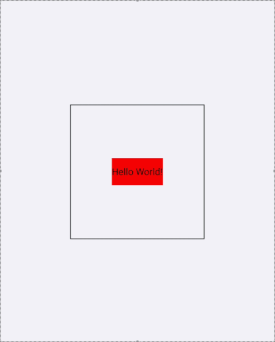

Today we are excited to release React Native 0.77!

This release ships several features: new styling capabilities such as support for `display: contents`, `boxSizing`, `mixBlendMode`, and `outline`-related properties to provide a more powerful layout options; Android 16KB page support to be compatible with the newer Android devices. We are also modernizing the community template by migrating it to Swift, while continuing to support and maintain compatibility with Objective-C for developers who prefer it.

<!--truncate-->

### Highlights

- [New CSS Features for better layouts, sizing and blending](#new-css-features-for-better-layouts-sizing-and-blending)
- [Android version 15 support & 16KB page support](#android-version-15-support--16kb-page-support)
- [Community CLI and Template Updates](#community-cli-and-template-updates)

### Breaking Changes

- [Removal of `console.log()` streaming in Metro](#removal-of-consolelog-streaming-in-metro)

## Highlights

### New CSS Features for better layouts, sizing and blending

React Native 0.77 furthers our goal of aligning React Native with the web. We've added support for new CSS properties to give you more control over your app's layout, sizing, and blending. These changes can help simplify complex layouts, add texture, and make your app more accessible.

:::info
All these new features are available only for the [New Architecture](/blog/2024/10/23/the-new-architecture-is-here#how-to-upgrade).
:::

#### Simpler layouts with `display: contents`

The [`display: contents`](https://developer.mozilla.org/en-US/docs/Web/CSS/display#display_contents) prop allows an element to disappear from the layout structure while its children are still rendered as if they were direct children of the parent element. It can be useful for styling purposes where you want to apply styles to child elements without affecting the layout, when building wrapper components which must handle events, or if you need to interact with the ShadowTree.

Technically speaking, `display: contents` renders an element without generating a layout box, but it preserves the layout boxes of the element’s children. The element with `display: contents` is effectively flattened out of the view hierarchy.

Let’s have a look at this example where we want to display an alert when a widget is pressed. We have a red `Widget` inside of a container view:

```jsx title="Container.jsx"
function Container() {
  return (
    <View style={styles.container}>
      <Widget />
    </View>
  );
}
```


Now, let's build a new `Alerting` wrapper component, with the goal of alerting the user when a component beneath it is pressed, using [experimental pointer events](/blog/2022/12/13/pointer-events-in-react-native). For clarity, the background of this component is made blue. That might look something like the component below:

```jsx title="Container.jsx"
function Alerting({children}) {
  return (
    <View
      style={{backgroundColor: 'blue'}}
      onPointerDown={() => alert('Hello World!')}>
      {children}
    </View>
}

function Container() {
  return (
    <View style={styles.container}>
      // highlight-next-line
      <Alerting>
        <Widget />
      </Alerting>
    </View>
  );
}
```

This doesn’t do quite what we want it to. `Alerting` adds a new layout box, with its own bounds, separate from the child `Widget`. Depending on the styling of the element it is wrapping, this may result in significant visual and functional changes. In this example, the blue background responds to taps with an alert when we want for only the red "Hello World" box to alert when tapped.


If we try this again, while setting `display: contents` on the `View` wrapper of `Alerting`, we only see alerts when the user presses within the original bounds of the `Widget`. This is because `Alerting` no longer adds its own box, but can still observe the pointer events bubbled from `Widget`.

```jsx title="Container.jsx"
function Alerting({children}) {
  return (
    <View
      // highlight-next-line
      style={{display: 'contents'}}
      onPointerDown={() => alert('Hello World!')}>
      {children}
    </View>
  );
}

// ... function Container ...
```



#### Box sizing

The `boxSizing` prop defines how the element's various sizing props (`width`, `height`, `minWidth`, `minHeight`, etc.) are computed. If `boxSizing` is `border-box`, these sizes apply to the border box of the element. If it is `content-box` they apply to the content box of the element. The default value is `border-box`, this is different from the default value on the web. The [web documentation](https://developer.mozilla.org/en-US/docs/Web/CSS/boxSizing) is a good source of information if you wish to learn more about how this prop works.

:::warning
`border-box` has been the default forever at this point, and has been the only `boxSizing` value up until we added `content-box`. Changing the default would have been a breaking change that would suddenly break several layouts. We decided to keep `border-box` as default value to ensure backward compatibility.
:::

To understand the difference between `border-box` and `content-box`, have a look at these example, where both `View`s have `padding: 20` and `borderWidth: 10`. When using `border-box`, we consider border and padding for the sizing; when using `content-box`, we consider only the content for the sizing.


#### CSS mixBlendMode

The `mixBlendMode` prop lets you control how an element blends its colors with the other elements in its **stacking context**. Check out the [MDN documentation](https://developer.mozilla.org/en-US/docs/Web/CSS/mix-blend-mode) for a full overview of each blending function.

To help have more granular control about what is blending together, we also added the `isolation` property. Setting `isolation: isolate` on a `View` will force it to form a **stacking context**. So, you can set this on some ancestor `View` to ensure that some descendent `View` with `mixBlendMode` does not blend beyond the **isolated** `View`.

##### mixBlendMode Values

- `normal`: The element is drawn on top of its background without blending.
- `multiply`: The source color is multiplied by the destination color and replaces the destination.
- `screen`: Multiplies the complements of the backdrop and source color values, then complements the result.
- `overlay`: Multiplies or screens the colors, depending on the backdrop color value.
- `darken`: Selects the darker of the backdrop and source colors.
- `lighten`: Selects the lighter of the backdrop and source colors.
<!--alex ignore black-->
- `color-dodge`: Brightens the backdrop color to reflect the source color. Painting with black produces no changes.
<!--alex ignore white-->
- `color-burn`: Darkens the backdrop color to reflect the source color. Painting with white produces no change.
- `hard-light`: Multiplies or screens the colors, depending on the source color value. The effect is similar to shining a harsh spotlight on the backdrop.
- `soft-light`: Darkens or lightens the colors, depending on the source color value. The effect is similar to shining a diffused spotlight on the backdrop.
- `difference`: Subtracts the darker of the two constituent colors from the lighter color.
- `exclusion`: Produces an effect similar to that of the Difference mode but lower in contrast.
- `hue`: Creates a color with the hue of the source color and the saturation and luminosity of the backdrop color.
- `saturation`: Creates a color with the saturation of the source color and the hue and luminosity of the backdrop color.
- `color`: Creates a color with the hue and saturation of the source color and the luminosity of the backdrop color. This preserves the gray levels of the backdrop and is useful for coloring monochrome images or tinting color images.
- `luminosity`: Creates a color with the luminosity of the source color and the hue and saturation of the backdrop color. This produces an inverse effect to that of the Color mode.


#### Outline props

We’ve also introduced `outlineWidth`, `outlineStyle`, `outlineSpread` and `outlineColor`. These outline props work very similar to the respective `border` props, but it is rendered around the **border box** as opposed to around the **padding box**. These props allow to highlight elements by drawing their outline without affecting their layout.

Check out the [MDN documentation](https://developer.mozilla.org/en-US/docs/Web/CSS/outline) for more details.


### Android version 15 support & 16KB page support

#### Forced edge-to-edge on Android 15

We’ve already done some work to support Android 15 on the prior release. One of the noticeable changes in Android 15 is forced edge-to-edge display when you build apps with `targetSdk` 35.

If you have not looked into this yet, please refer to our prior [recommendation](https://github.com/react-native-community/discussions-and-proposals/discussions/827) on how this should be handled as ignoring this can potentially break your UI in the app.

:::note
If you are using the [`react-native-safe-area-context`](https://www.npmjs.com/package/react-native-safe-area-context) in your app, the library is already handling the forced edge-to-edge for you.
:::

#### 16 KB page size support for Android

Android 15 introduces support for 16KB memory page size enabling [performance improvements](https://developer.android.com/guide/practices/page-sizes#benefits) for apps and more, but making previous 4KB-based apps potentially incompatible on future devices; it's currently an opt-in feature for developers to test on select devices to prepare for 16 KB page size being the OS default.

With the 0.77 release, React Native is ready to fully support 16 KB page size and developers will be able to test and ship apps for 16 KB devices using it.

Please refer to [the official Android Developers site](https://developer.android.com/guide/practices/page-sizes) for further information on 16 KB support.

### Community CLI and Template Updates

#### Community CLI: react-native init deprecation

This version fully completes the deprecation of the `react-native init` command that was [introduced in React Native 0.75](/blog/2024/08/12/release-0.75#sunsetting-react-native-init).

As a reminder, you won’t be able to use the `react-native init` command anymore, but you’ll have to either:

- [Use a framework](/blog/2024/06/25/use-a-framework-to-build-react-native-apps) such as Expo, with its own dedicated command to create a new project: `npx create-expo-app`
- Invoke the Community CLI directly with `npx @react-native-community/cli init`

#### Community CLI: Removal of "run on iOS/Android" key handlers from Metro

In this version, we removed the ‘a’ and ‘i’ keyboard shortcuts from Metro. Those shortcuts were used to invoke the `run-android` & `run-ios` community CLI commands.
Those keyboard shortcuts provided worse developer experience and were rarely used. Moreover, we believe that frameworks are better suited to orchestrate the terminal outputs.

You can read more about this change [in this dedicated post](https://github.com/react-native-community/discussions-and-proposals/discussions/821).

#### Community Template: Swift as programming language for iOS apps

:::info
Projects using Expo should not be affected by this change.
:::

This change let us slim down the community template by replacing three files (`main.m`, `AppDelegate.h` and `AppDelegate.mm`) with a single, new [`AppDelegate.swift`](https://github.com/react-native-community/template/blob/main/template/ios/HelloWorld/AppDelegate.swift).

This is technically a breaking change: you’ll see the change from Objective-C to Swift in the upgrade helper like this:


You don’t have to migrate to Swift: the Objective-C++ variant of the iOS community template is still supported (note that you still need to integrate the [`RCTAppDependencyProvider`](#rctappdependencyprovider)). New projects will be generated by using Swift as the iOS app language, although you can always migrate back to Objective-C if you need to.

##### Limitations

If your app has some local modules that are written in C++, you would not be able to register them in Swift as shown in [this guide](/docs/next/the-new-architecture/pure-cxx-modules#3-registering-the-cxx-turbo-native-module-in-your-app).

If your app falls in this category, please skip the migration of the AppDelegate to Swift, and keep using Objective-C++ for your app.

React Native core is mostly developed using C++ to encourage code sharing between iOS and Android and other platforms. The interoperability between Swift and C++ is not mature nor stable, yet. We are looking into ways to fill this gap and let you migrate to Swift too.

##### RCTAppDependencyProvider

React Native 0.77 slightly changes how the app loads third party dependencies. This is a new line in the community template that, if missed, can cause some runtime issues. Make sure to add it to your app.

The equivalent Objective-C lines are the following:

```objc title="AppDelegate.mm"
#import "AppDelegate.h"

#import <React/RCTBundleURLProvider.h>
// highlight-next-line
#import <ReactAppDependencyProvider/RCTAppDependencyProvider.h>


@implementation AppDelegate

- (BOOL)application:(UIApplication *)application didFinishLaunchingWithOptions:(NSDictionary *)launchOptions
{
  self.moduleName = @"<Your app Name>";
  // highlight-next-line
  self.dependencyProvider = [RCTAppDependencyProvider new];
  // You can add your custom initial props in the dictionary below.
  // They will be passed down to the ViewController used by React Native.
  self.initialProps = @{};

  return [super application:application didFinishLaunchingWithOptions:launchOptions];
}

// remaining of the AppDelegate

```

## Breaking Changes

### Removal of `console.log()` streaming in Metro

We want every aspect of React Native debugging to behave reliably and to match the functionality of modern browser tooling. To meet this quality bar, log forwarding via Metro, originally deprecated in 0.76, is removed in 0.77.

This integration relied on a custom approach to communicate with the debugging target on device. With this change, we are moving exclusively to the Chrome DevTools Protocol (CDP).

- To view JS logs, please use [React Native DevTools](/docs/react-native-devtools) and its fully featured Console panel — supporting log filtering, rich object inspection, Live Expressions, and more.
- You can also connect VS Code as a CDP debugger, via third party extensions such as [Expo Tools](https://github.com/expo/vscode-expo) and [Radon IDE](https://ide.swmansion.com/).
  - Please note that these integrations are not directly supported by the React team. However, we are working on first party VS Code support in 2025.
- Expo continues to offer log streaming in Expo CLI.

For more info, see [_Why are JavaScript logs leaving Metro?_](https://github.com/react-native-community/discussions-and-proposals/discussions/819#:~:text=Why%20are%20JavaScript%20logs%20leaving%20Metro%3F)

### Other Breaking Changes

#### General

- Animation
  - Native looping animation do not send a React state update every time the loop ends.
- Layout
  - `position` of sticky headers on `ScrollView` will now be taken into account.
  - Absolute positioning is now behaving in a more compliant way
- JS Modules:
  - Remove `ReactFabricInternals` module
    - This is not going to be accessible anymore
- Native Modules
  - `NativeModules` object can now be used to load turbomodules in JS .
    - This improves compatibility between Native Modules and Turbo Native Modules
- Packages
  - dev-middleware: Frameworks should specify `serverBaseUrl` relative to the middleware host
- API Changes:
  - Removed type for `useConcurrentRoot` from `AppRegistry`, as it was already ignored
  - Removed `refs` property from `NativeMethods` TypeScript definition.
- UX Changes:
  - Remove "run on iOS" and "run on Android" from the dev server key commands

#### Android

- Kotlin
  - This is the first version of React Native that builds against Kotlin 2.0.21. You can read more about the changes coming with Kotlin 2.0 on the [language release notes](https://kotlinlang.org/docs/whatsnew2020.html).
- API Changes:
  - Nullability:
    - Non-primitive getters in `ReadableArray` are now correctly typed as optional
    - Make `ReactHost.createSurface()` method non nullable
  - Renamed:
    - `DevSupportManagerBase.getCurrentContext()` to `DevSupportManagerBase.getCurrentReactContext()`

Additionally, several APIs have been removed or restricted in visibility, so they can’t be accessed anymore. Those APIs were internal and not needed to React Native developers directly. You can find the full list below:

<details>
<summary>List of Removed Android APIs:</summary>

The following packages are now internal and can’t be accessed anymore:

- `com.facebook.react.views.progressbar`
- `com.facebook.react.views.safeareaview`
- `com.facebook.react.modules.accessibilityinfo`
- `com.facebook.react.modules.appstate`
- `com.facebook.react.modules.clipboard`
- `com.facebook.react.modules.devmodule`
- `com.facebook.react.modules.reactdevtoolssettings`
- `com.facebook.react.views.unimplementedview`

The following classes are now either internal or have been removed, so can’t be accessed anymore:

- `BackHandler.removeEventListener`
- `BaseViewManagerInterface`
- `BindingImpl`
- `CompositeReactPackage`
- `DebugOverlayTags`
- Method `create()` from `DefaultDevSupportManagerFactory`
- `DevToolsReactPerfLogger`
- `FabricComponents`
- `ImageStoreManager`
- `InteropModuleRegistry`
- `NativeModulePerfLogger`
- `NoopPrinter`
- `NotThreadSafeViewHierarchyUpdateDebugListener`
- `OkHttpCallUtil`
- `PrinterHolder`
- `Printer`
- `ReactDebugOverlayTags`
- `ReactNativeFlipper`
- `ReactViewBackgroundManager`
- `ReactViewGroup.getBackgroundColor()`
- `ReactVirtualTextShadowNode`
- `ReactVirtualTextViewManager`
- `SimpleSettableFuture`
- `SwipeRefreshLayoutManager`
- `TaskCompletionSource`
- Parameter `jsBundleLoader` from DefaultReactHost.getDefaultReactHost()
</details>

#### iOS

- API Changes
  - Removed
    - `RCTConstants.RCTGetMemoryPressureUnloadLevel`
    - `partialBatchDidFlush`
    - `RCTRuntimeExecutor`
    - `UseNativeViewConfigsInBridgelessMode`
      - Replaced by a proper feature flag
    - `UseTurboModuleInteropForAllTurboModules`
      - Interop layer is always on for TMs
  - Changed
    - Replace uses of `CGColorRef` with `UIColor`
- `RCTAppDelegate` now requires to use the `RCTDependencyProvider` to load third party dependencies
- CocoaPods sets C++ version for all the 3rd party dependencies to avoid compilation issues.

## Acknowledgements

React Native 0.77 contains over **1061** commits from **161** contributors. Thanks for all your hard work!

Thanks to all the additional authors that worked on documenting features in this release post:

- [Jakub Piasecki](https://github.com/j-piasecki) for contributing to the `display: contents` feature
- [Nick Gerleman](https://github.com/NickGerleman), [Joe Vilches](https://github.com/joevilches) and [Jorge Cabiedes Acosta](https://github.com/jorge-cab) for releasing the new styling features
- [Alan Lee](https://github.com/alanleedev) for the Android 16Kb page support content
- [Riccardo Cipolleschi](https://github.com/cipolleschi) for supporting the migration of the template to Swift
- [Nicola Corti](https://github.com/cortinico) for the `react-native init` deprecation cycle content
- [Alex Hunt](https://github.com/huntie) for the content on the removal of `console.log` from metro

### Upgrade to 0.77

Please use the [React Native Upgrade Helper](https://react-native-community.github.io/upgrade-helper/) to view code changes between React Native versions for existing projects, in addition to the Upgrading docs.

To create a new project:

```sh
npx @react-native-community/cli@latest init MyProject --version latest
```

If you use Expo, React Native 0.77 will be supported in Expo SDK 52 (instructions on how to update React Native inside your Expo project to 0.77.0 will be available in a separate Expo blog post in the near future).

:::info
0.77 is now the latest stable version of React Native and 0.74.x moves to unsupported. For more information see [React Native's support policy](https://github.com/reactwg/react-native-releases/blob/main/docs/support.md#releases-support-policy). We aim to publish a final end-of-life update of 0.74 in the near future.
:::
