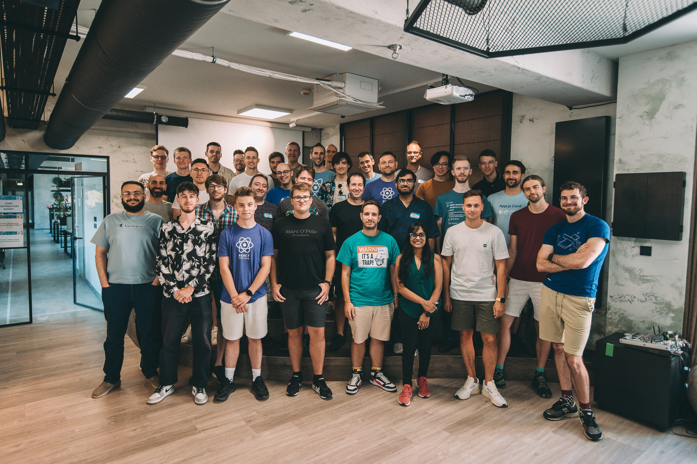

Every year, the core contributors in the React Native Community get together with the React Native team to collaboratively shape the direction of this project.

Last year was no different—with small exception. We usually meet a day before [React Universe Conf](https://www.reactuniverseconf.com) (formerly React Native EU) at [Callstack](https://www.callstack.com/open-source) HQ in Wrocław. In 2024, learning from past experiences, we hosted the Summit for two consecutive days, so that we can have more unstructured time together.

<!--truncate-->

This annual tradition has become a valuable opportunity for contributors to share insights and voice their concerns, and for the core team to share their plans and gather feedback from key contributors to the React Native ecosystem—including partner companies, individual library authors and friends.

We divided the Summit into two tracks covering following topics:

- [Releases](#releases)
- [What's next after the New Architecture?](#whats-next-after-the-new-architecture)
- [Web APIs spec for Native Modules](#web-apis-for-native-modules)
- [LeanCore 2.0](#leancore-20)
- [Nitro Modules - Unblocking View Components by exposing props as jsi::Values](#nitro-modules---unblocking-view-components-by-exposing-props-as-jsivalues)
- [Out Of Tree Platforms & CocoaPods](#out-of-tree-platforms--cocoapods)
- [React Native on Desktop](#react-native-on-desktop)

In this blog post, we’d like to give you a sneak peek of the results of this gathering.

## Releases

We had an extensive discussion about the release process for React Native. Core Team appreciates the value of having contributors from outside Meta involved in releases and emphasizes the importance of having nightly releases, which are particularly beneficial for Out-of-Tree platforms like React Native visionOS, library maintainers (Reanimated) and frameworks (Expo). We discussed the frequency of releases, with some folks asking for more frequent releases to ship fixes faster, while others expressed concerns about the impact on 3rd party libraries and upgrading efforts.

We also brainstormed ways to reduce unintentional breaking changes and improve communication about compatibility between React Native and 3rd party dependencies.

This session showed how complex it is to manage releases for React Native, and how delicate this topic is, given all the different parts of the ecosystem that need to be considered.

## What's next after the New Architecture?

Now that the New Architecture has shipped as stable, we discussed what we should focus on next. What could be the next big thing? The topics revolved around:

- **Web compatibility** – concluded in the discussion around direction of the React Strict DOM project, which should be treated as a temporary polyfill, while the Xplat team implements proper cross-platform functionality into the core of React Native.
- **Stabilizing the core API** – turned out we need more consensus on what this means for app developers, library authors, Out-of-Tree platforms. E.g. it may be necessary to extract platform-native logic for iOS and Android from the shared C++ codebase. Part of which was covered by the LeanCore 2.0 discussion.
- **Old architecture support** – as expected, the team confirmed that new React 19 features based on concurrent rendering, won’t work in old architecture. New features are primarily targeted for the new architecture. Due to blockers in React 19 release schedule it’s still not clear where to draw the line between functionality supported by both new and old architecture.
- **3rd party libraries for React Native** – today we library authors can use TurboModules, ExpoModules, recently NitroModules to achieve the same goal of bridging native platform functionality. We need better documentation on how to make it well.
- **Brownfield docs** – at the time of the summit, the official documentation for integrating React Native into native apps was quite dated. Since then the team has followed through with up-to-date and simpler docs for Android and iOS.
- **Tree-shaking for Metro web** – core Metro team is open to merge the work from the Expo team in this area.

## Web APIs for Native Modules

This session was dedicated to Microsoft's RFC revolving around the idea of bringing a subset of Web APIs to React Native. It aims to enhance React Native’s scalability and attract more web developers by leveraging familiar APIs. Opening access to a wealth of existing open-source web libraries that don't have explicit React Native support.

Standardizing on Web API specifications is not only beneficial but also essential for React Native growth, and aligns well with our Many Platforms vision and react-strict-dom project. The web offers a unified interface through its specifications, which React Native community modules currently lack. Microsoft has identified around 200 essential Web APIs that could be implemented first for platforms they support: iOS, Android, Windows and macOS.

We encourage library developers to align their APIs with web specifications whenever possible, as this standardization will improve code portability and developer experience across platforms.

While the proposal seems beneficial for the future of React Native, we're still brainstorming the next steps forward. One concern we noticed is governance of the APIs, and whether they’d need to live in a separate repository from the platform implementations. Another around diverging from the official specification in case a specific platform allows for behaviors not specified by the W3C. We would need to figure out how to avoid bundling unnecessary modules, e.g. with a Babel plugin. Not to mention the scope of such initiative is quite large.

The session conclusion reinforced two key points: First, there is strong alignment across the React Native community on adopting web-compatible specifications where possible. Second, we need to establish a clear technical strategy for how these Web API implementations can be maintained separately for different platforms. Microsoft together with Callstack could work on refining the original RFC and produce a proof of concept implementation for a smaller number of APIs as a community initiative. This incremental approach will help us validate the design and developer experience before expanding the scope.

## LeanCore 2.0

In 2019, the React Native team started the Lean Core initiative. The goal was to tackle the surface area of React Native’s core and reduce APIs and components that were outdated and legacy. Since then, the React Native components and API surfaces have been long overdue another round of clean up.

Today, there are many components that are not actively being maintained with better community alternatives. Additionally, there are components that have duplicates that should eventually be consolidated for maintainability.

On the API side, a lot of the JS layer APIs are tied to native iOS & Android implementations, rather than being truly platform agnostic. For example, with Pressable, we have props like `android_disableSound` and `android_ripple`. Ideally, React Native components should have the smallest possible API surface that is not tied to any specific platform.

As Out-of-Tree platforms are growing and being adopted more by the ecosystem, there needs to be a path to reduce the component and API surface of React Native core, reducing the load on the React Native core team, and also making it significantly easier for Out-of-Tree platform & library maintainers to stay up-to-date.

As an added bonus, this would make it easier for beginner app developers to pick up React Native, as there are less duplicated components and "gotchas" for them to learn. Where there is a better community alternative, developers can be signposted and encouraged to use the community alternatives available.

During the session, we discussed:

- The high level motivations of Lean Core and the benefits to the parties involved (developers, library maintainers, Meta)
- An aggregated view of what components are being used in some real-world production React Native apps
- The criteria of what is a candidate to be removed from core
- A clear action plan for executing Lean Core 2.0 with:
  - The high-level process for deprecation
  - Handling cases where Meta is using components internally that have better community alternatives,

As a next step, a group of the core contributors will look at collecting more telemetry and data, assessing community alternatives, and putting together an RFC detailing the proposed changes.

## Nitro Modules - Unblocking View Components by exposing props as jsi::Values

Recently, Marc Rousavy introduced Nitro Modules as an alternative approach to creating Native Modules. Nitro Modules utilize experimental C++ Swift Interop and incorporate a bunch of enhancements that can lead to improved performance in certain scenarios. However, during this session, we discussed the various trade-offs involved between Nitro Modules and existing TurboModules.

While Nitro Modules offer some performance benefits, they also have limitations and considerations that need to be addressed. For example, the use of experimental interop features might introduce complexity or compatibility issues that are not present in TurboModules. Our discussion focused on these trade-offs and the potential for upstreaming some of Nitro Modules' improvements into React Native Core, which could allow developers to benefit from more performant modules for everyone.

## Out-of-Tree Platforms & CocoaPods

Out-of-Tree Platforms presents the full power of React Native, where we can share one JS codebase between different platforms running on our mobile devices, desktops or even on VR/XR devices. Creating such a platform currently isn’t the easiest process, actually there are no guidelines on how things should be created, developed and maintained. Also React Native Core in a way is tied to Android and iOS platforms. In the future we could aim for a scenario where all the platforms are treated equally and integrate with a C++/JS core through the same APIs.

During this session maintainers of different platforms discussed what are the problems, what they struggle with and what should be the solution to unify the process of creating and maintaining new Out-of-Tree platforms.

Another aspect of this session was to discuss CocoaPods and future plans related to managing native dependencies. Recently the CocoaPods team announced that they’ve moved to maintenance mode and new major improvements or features won’t be shipped. There are various alternatives that could be used and during this session we discussed their pros and cons, and what migration would look like.

## React Native on Desktop

Steven and Saad from Microsoft, maintainers of react-native-windows and react-native-macos, hosted a session to listen and gather feedback from contributors related to Desktop platforms. Topics discussed included exploring how to increase adoption of React Native for Desktop (such as having a dedicated workflow in Visual Studio, or exposing desktop as part of Nx), as well as how to support Expo, which is a continual pain point for more adoption.

There’s a big discrepancy in availability of community modules between macOS and Windows, largely due to the fact that iOS code is mostly compatible with macOS, while RNW needs bespoke implementations. While working on the New Architecture for React Native for Windows, the team sees potential in C++ modules allowing for even more code sharing across platforms which will hopefully ease the burden of targeting desktop platforms. It’s worth noting that on the community side Software Mansion is working on adding desktop support for their most popular modules, such as React Native Screens, Gesture Handler and Reanimated.

---

We’re still impressed by how spending several hours together for a couple of days resulted in so much knowledge-sharing and cross-pollination of ideas. During this summit, we planted the seeds for initiatives that will help us improve and re-shape the React Native ecosystem.

If you’re interested in joining the development of React Native, make sure you join our open initiatives and read the [contribution guide](https://reactnative.dev/contributing/overview) we have on our website. We hope to meet you in person as well in the future!
