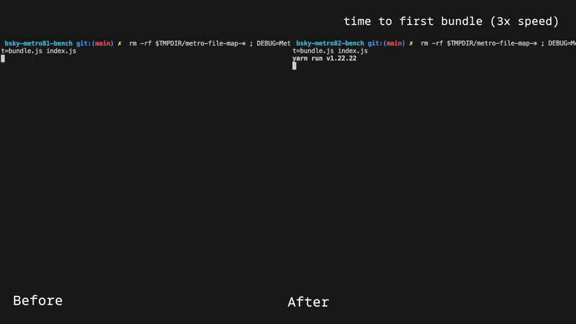

# React Native 0.79 - Faster tooling, faster startup and much more

Today we are excited to release React Native 0.79!

This release ships with performance improvements on various fronts, as well as several bugfixes. First, Metro is now faster to start thanks to deferred hashing, and has stable support for package exports. Startup time in Android will also be improved thanks to changes in the JS bundle compressions and much more.

### Highlights

- [New Metro Features](/blog/2025/04/08/react-native-0.79#metro-faster-startup-and-package-exports-support)
- [JSC moving to a Community Package](/blog/2025/04/08/react-native-0.79#jsc-moving-to-community-package)
- [iOS: Swift-Compatible Native Modules registration](/blog/2025/04/08/react-native-0.79#ios-swift-compatible-native-modules-registration)
- [Android: Faster App Startup](/blog/2025/04/08/react-native-0.79#android-faster-app-startup)
- [Removal of Remote JS Debugging](/blog/2025/04/08/react-native-0.79#removal-of-remote-js-debugging)

<!--truncate-->

## Highlights

### Metro: Faster startup and package exports support

This release ships with [Metro 0.82](https://github.com/facebook/metro/releases/tag/v0.82.0).This version uses deferred hashing to improve the speed of first `yarn start` typically by over 3x (more in larger projects and monorepos) making your development experience and CI builds faster on a daily basis.



Also in Metro 0.82, we’re promoting `package.json` `exports` and `imports` field resolution to stable. `exports` resolution was [introduced in React Native 0.72](https://reactnative.dev/blog/2023/06/21/package-exports-support), and `imports` support was added in a community contribution - both will now be enabled by default for all the projects on React Native 0.79.

This improves compatibility with modern npm dependencies, and opens up new, standards-compliant ways to organise your projects.

### JSC moving to Community Package

As part of our effort to reduce the API surface of React Native, we're in the process of moving the JavaScriptCore (JSC) engine to a community-maintained package: `@react-native-community/javascriptcore`

This change will not affect users that are using Hermes.

Starting with React Native 0.79, you can use a community supported version of JSC by following the [installation instructions in the readme](https://github.com/react-native-community/javascriptcore#installation). The JSC version provided by React Native core will still be available in 0.79, but we’re planning to remove it [in the near future](https://github.com/react-native-community/discussions-and-proposals/blob/main/proposals/0836-lean-core-jsc.md).

Moving JSC to a community maintained package will allow us to update the JSC version more frequently and offer you the latest features. The community maintained JSC will follow a separate release schedule from React Native.

### iOS: Swift-Compatible Native Modules registration

In this release, we are revamping the way in which you can register your Native Module into the React Native runtime. The new approach follows the same approach of components, described in the [official documentation](https://reactnative.dev/docs/next/the-new-architecture/using-codegen#configuring-codegen).

Starting from this version of React Native, you can register your modules by modifying the `package.json` file. We introduced a new `modulesProvider` field in the `ios` property:

```diff
"codegenConfig": {
     "ios": {
+       "modulesProvider": {
+         "JS Name for the module": "ObjC Module provider for the pure C++ TM or a class conforming to RCTTurboModule"
+     }
    }
}
```

Codegen will take care to create all the relevant code starting from your `package.json` file.

If you do use a pure C++ Native Module you will have to follow this recommended configuration:

<details>
<summary>Configure pure C++Native Modules in your app</summary>

For pure C++ Native Modules, you need to add a new ObjectiveC++ class to glue together the C++ Native Module with the rest of the App:

```objc title=”CppNativeModuleProvider.h”
// .h file

#import <Foundation/Foundation.h>
#import <ReactCommon/RCTTurboModule.h>

NS_ASSUME_NONNULL_BEGIN

@interface <YourNativeModule>Provider : NSObject <RCTModuleProvider>

@end
```

```objc title=”CppNativeModuleProvider.mm”

NS_ASSUME_NONNULL_END

// .mm file
#import "<YourNativeModule>Provider.h"
#import <ReactCommon/CallInvoker.h>
#import <ReactCommon/TurboModule.h>
#import "<YourNativeModule>.h"

@implementation NativeSampleModuleProvider

- (std::shared_ptr<facebook::react::TurboModule>)getTurboModule:
    (const facebook::react::ObjCTurboModule::InitParams &)params
{
  return std::make_shared<facebook::react::NativeSampleModule>(params.jsInvoker);
}
```

</details>

With this new approach, we unified the registration of Native Modules for both app developers and library maintainers. Libraries can specify the same properties in their `package.json` and Codegen will take care of the rest.

This approach solves the limitation we introduced in 0.77 that prevented the registration of a pure C++ Native Module with a Swift `AppDelegate`. As you can see, none of these changes modifies the `AppDelegate` and the generated code will work for `AppDelegate` implemented with both Swift and Objective-C.

### Android: Faster App Startup

We’re also shipping a change to improve your Android startup time by a significant amount.

Starting with this version, we won’t be compressing the JavaScript bundle anymore inside the APK. Previously, the Android system needed to uncompress the JavaScript bundle before your app could start. This was causing a significant slowdown during the app startup.

Starting from this release, we will be shipping the Javascript Bundle uncompressed by default, so your Android apps will be generally faster to start.

We tested this feature on the Discord app and got a significant performance boost: Discord’s time-to-interactive (TTI) was reduced by 400ms, which was a 12% speedup with a one-line change (tested on a Samsung A14).

On the other hand, storing the bundle uncompressed, will result in a higher space consumption for your application on the user device. If this is a concern to you, you can toggle this behavior using the `enableBundleCompression` property in your `app/build.gradle` file.

```kotlin
react {
  // ...
  // If you want to compress the JS bundle (slower startup, less
  // space consumption)
  enableBundleCompression = true
  // If don't you want to compress the JS bundle (faster startup,
  // higher space consumption)
  enableBundleCompression = false

  // Default is `false`
}
```

Please note that the APK size will increase in this release, but your users won’t be paying the extra cost in APK download size, as the APKs are compressed when downloaded from the network.

## Breaking Changes

### Removal of Remote JS Debugging

As part of our ongoing efforts to improve debugging, we're removing Remote JS Debugging via Chrome. This legacy debugging method was deprecated, [and moved to a runtime opt-in, in React Native 0.73](https://reactnative.dev/blog/2023/12/06/0.73-debugging-improvements-stable-symlinks#remote-javascript-debugging). Please use [React Native DevTools](https://reactnative.dev/docs/react-native-devtools) for modern and reliable debugging.

This also means that React Native is no longer compatible with the [react-native-debugger](https://github.com/jhen0409/react-native-debugger) community project. For developers that want to use third party debugging extensions, such as Redux DevTools, we recommend [Expo DevTools Plugins](https://github.com/expo/dev-plugins), or integrating the standalone versions of these tools.

Read more in [this dedicated post](https://github.com/react-native-community/discussions-and-proposals/discussions/872).

### Internal modules updated to `export` syntax

As part of modernizing our JavaScript codebase, we've updated a number of implementation modules within `react-native` to consistently use `export` syntax instead of `module.exports`.

We've updated around **46 APIs** in total, which can be found in the [changelog](https://github.com/facebook/react-native/blob/main/CHANGELOG.md#v0790).

This change has a subtle impact on existing imports:

<details>
<summary>**Case 1: Default export**</summary>
 
```diff
  // CHANGED - require() syntax
- const ImageBackground = require('react-native/Libraries/Image/ImageBackground');
+ const ImageBackground = require('react-native/Libraries/Image/ImageBackground').default;

// Unchanged - import syntax
import ImageBackground from 'react-native/Libraries/Image/ImageBackground';

// RECOMMENDED - root import
import {ImageBackground} from 'react-native';

````

</details>

<details>

<summary>**Case 2: Secondary exports**</summary>

There are very few cases of this pattern, again unaffected when using the root `'react-native'` import.

```diff
  // Unchanged - require() syntax
  const BlobRegistry = require('react-native/Libraries/Blob/BlobRegistry');

  // Unchanged - require() syntax with destructuring
  const {register, unregister} = require('react-native/Libraries/Blob/BlobRegistry');

  // CHANGED - import syntax as single object
- import BlobRegistry from 'react-native/Libraries/Blob/BlobRegistry';
+ import * as BlobRegistry from 'react-native/Libraries/Blob/BlobRegistry';


  // Unchanged - import syntax with destructuring
  import {register, unregister} from 'react-native/Libraries/Blob/BlobRegistry';

  // RECOMMENDED - root import
  import {BlobRegistry} from 'react-native';
````

</details>

We expect the impact of this change to be extremely limited, particularly for projects written in TypeScript and using `import` syntax. Please check for any type errors to update your code.

:::tip

**The root `react-native` import is strongly recommended**

As a general takeaway, we strongly recommend importing from the root `'react-native'` path, to avoid extraneous breaking changes in future. In our next release, we will be deprecating deep imports, as part of better defining React Native's public JavaScript API ([see the RFC](https://github.com/react-native-community/discussions-and-proposals/pull/894)).

:::

### Other Breaking Changes

This list contains a series of other breaking changes we suspect could have a minor impact to your product code and are worth noting.

- **Invalid unitless lengths in box shadows and filters**:
  - In order to make React Native more compliant with the CSS/Web specs, we now don’t support anymore unitless lengths in `box-shadow` and `filter`. This means that if you were using a `box-shadow` of `1 1 black` we won’t be rendering. You should instead specify units such as `1px 1px black`
- **Remove incorrect hwb() syntax support from normalize-color:**
  - In order to make React Native more compliant with the CSS/Web specs, we now restrict some invalid syntax for `hwb()`. Historically React Native used to support comma separated values (e.g. `hwb(0, 0%, 100%)`) which we now don’t support anymore (you should migrate to `hwb(0 0% 100%)`). You can read more about this change [here](https://github.com/facebook/react-native/commit/676359efd9e478d69ad430cff213acc87b273580).
- **Libraries/Core/ExceptionsManager exports update**
  - As part of our effort to modernize the React Native JS API, we updated <code>[ExceptionsManager](https://github.com/facebook/react-native/blob/0.79-stable/packages/react-native/Libraries/Core/ExceptionsManager.js)</code> to now export a default `ExceptionsManager` object, and `SyntheticError` as a secondary export.

## Acknowledgements

React Native 0.79 contains over 944 commits from 100 contributors. Thanks for all your hard work!

We want to send a thank you to those community members that shipped significant contributions in this release:

- [Marc Rousavy](https://github.com/mrousavy) for developing and documenting the “Android: Faster App Startup” feature
- [Kudo Chien](https://github.com/Kudo) and [Oskar Kwaśniewski](https://github.com/okwasniewski)for working on the `@react-native-community/javascriptcore` package and writing the “JSC moving to Community Package” section
- [James Lawson](https://github.com/facebook/metro/pull/1302) for adding support for import subpath resolution [in Metro](https://github.com/facebook/metro/pull/1302).

Moreover, we also want to thank the additional authors that worked on documenting features in this release post:

- [Rob Hogan](https://github.com/robhogan) for the “New Metro Features” section
- [Alex Hunt](https://github.com/huntie) for the “Removal of Remote JS Debugging” and “Internal modules updated to export syntax” sections
- [Riccardo Cipolleschi](https://github.com/cipolleschi) for the work on iOS Native Module registration

## Upgrade to 0.79

Please use the [React Native Upgrade Helper](https://react-native-community.github.io/upgrade-helper/) to view code changes between React Native versions for existing projects, in addition to the Upgrading docs.

To create a new project:

```
npx @react-native-community/cli@latest init MyProject --version latest
```

If you use Expo, React Native 0.79 will be supported in the upcoming Expo SDK 53 as the default version of React Native.

:::info

0.79 is now the latest stable version of React Native and 0.76.x moves to unsupported. For more information see [React Native's support policy](https://github.com/reactwg/react-native-releases/blob/main/docs/support.md). We aim to publish a final end-of-life update of 0.76 in the near future.

:::
