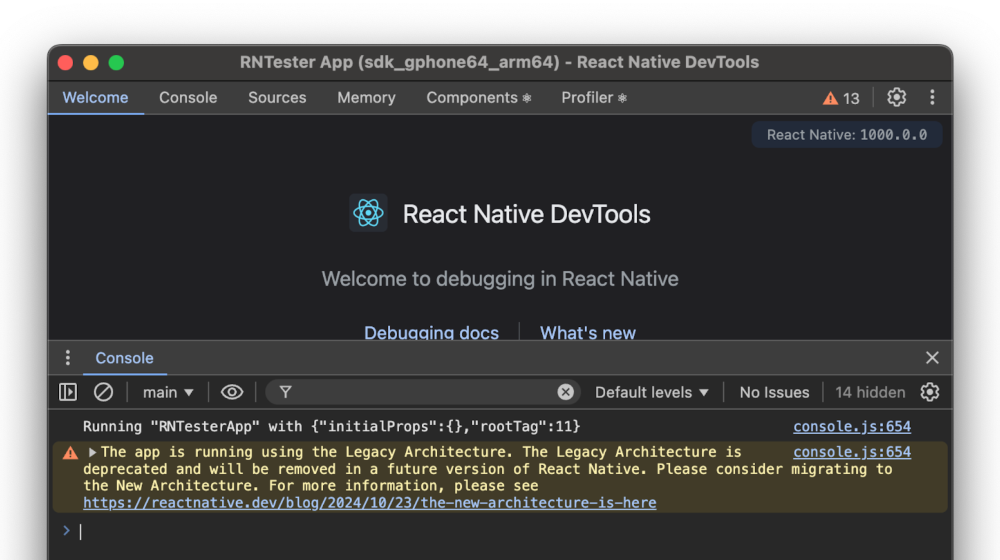
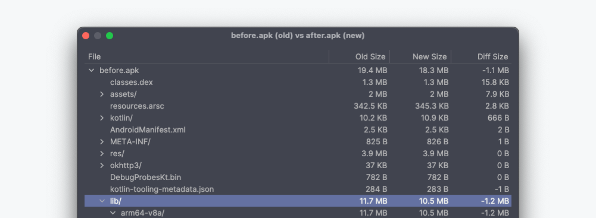
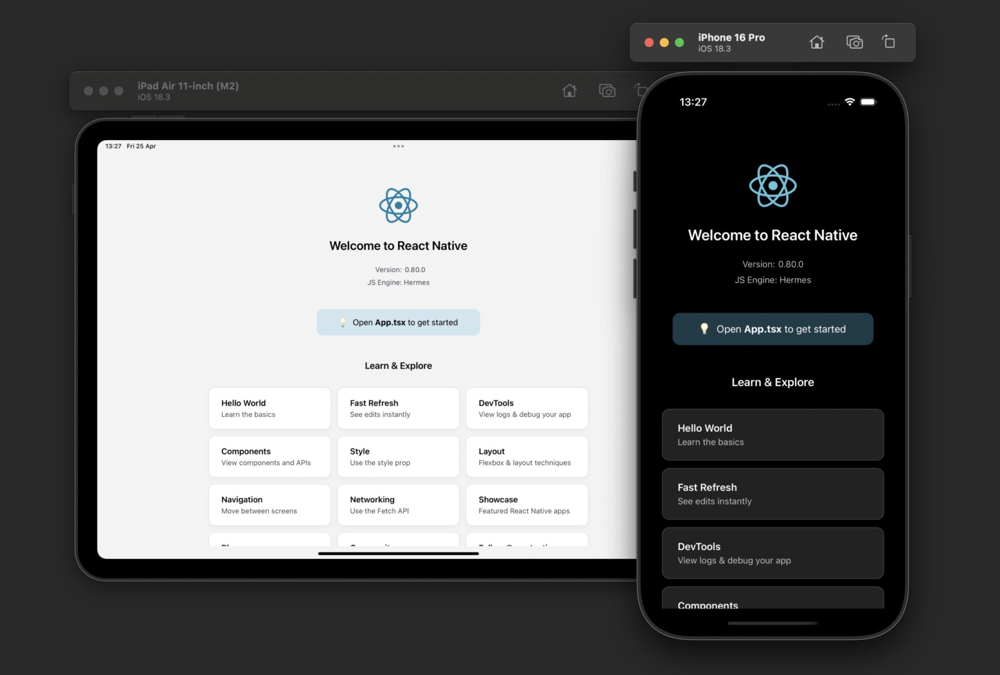

# React Native 0.80 - React 19.1, JS API Changes, Freezing Legacy Arch and much more

Today we are excited to release React Native 0.80!

This release brings the version of React we ship inside React Native to the latest stable available: 19.1.0.

We’re also shipping a series of stability improvements to our JS API: deep imports will now fire a warning and we’re offering a new opt-in Strict TypeScript API which offers types that are more accurate and safer to use.

Moreover, the Legacy Architecture of React Native is now officially frozen, and you’ll start seeing warnings for APIs that will stop working once we fully sunset the Legacy Architecture.

### Highlights

- [JavaScript deep imports deprecation](/blog/2025/06/12/react-native-0.80#javascript-deep-imports-deprecation)
- [Legacy Architecture Freezing & Warnings](/blog/2025/06/12/react-native-0.80#legacy-architecture-freezing--warnings)
- [React 19.1.0](/blog/2025/06/12/react-native-0.80#react-1910)
- [Experimental - React Native iOS dependencies are now prebuilt](/blog/2025/06/12/react-native-0.80#experimental---react-native-ios-dependencies-are-now-prebuilt)

<!--truncate-->

## Highlights

### JavaScript deep imports deprecation

In this release, we are making moves to improve and stabilize React Native's public JavaScript API. The first step towards this is better scoping of which of our APIs are importable by apps and frameworks. In line with this, we are formally deprecating deep imports from React Native ([see RFC](https://github.com/react-native-community/discussions-and-proposals/pull/894)), and are introducing warnings via ESLint and the JS console.

These warnings are scoped to imports from within your project's source code, and can be [opted out from](https://reactnative.dev/blog/2025/06/12/moving-towards-a-stable-javascript-api#deprecating-deep-imports-from-react-native). However, please bear in mind that we aim to remove deep imports from React Native's API in a future release, and these should instead be updated to the root import.

```js
// Before - import from subpath
import {Alert} from 'react-native/Libraries/Alert/Alert';

// After - import from `react-native`
import {Alert} from 'react-native';
```

Some APIs are not exported at root, and will become unavailable without deep imports. This is intentional, in order to reduce the overall surface area of React Native's API. We have an open [feedback thread](https://github.com/react-native-community/discussions-and-proposals/discussions/893) for user issues, and will be working with the community to finalize which APIs we export over (at least) the next two React Native releases. Please share your feedback!

Learn more about this change in our dedicated post: [Moving Towards a Stable JavaScript API](/blog/2025/06/12/moving-towards-a-stable-javascript-api).

#### Opt-in Strict TypeScript API

With the above redefinition of the exports in our public API, we're also shipping a new set of TypeScript types for the `react-native` package in 0.80, which we're calling the Strict TypeScript API.

Opting into the Strict TypeScript API is a preview of our future, stable JavaScript API for React Native. These new types are:

1. **Generated directly from our source code** — improving coverage and correctness, so you can expect stronger compatibility guarantees.
2. **Restricted to React Native's index file** — more tightly defining our public API, and meaning we won't break the API when making internal file changes.

We're shipping these alongside our existing types, meaning you can choose to migrate when ready. Also, if you're using standard React Native APIs, a lot of apps should validate with **no changes**. We strongly encourage early adopters and newly created apps to opt in via your `tsconfig.json` file.

When the community is ready, the Strict TypeScript API will become our default API in future — synchronized with deep imports removal.

Learn more about this change in our dedicated post: [Moving Towards a Stable JavaScript API](/blog/2025/06/12/moving-towards-a-stable-javascript-api).

### Legacy Architecture Freezing & Warnings

The New Architecture of React Native is the default choice [since version 0.76](/blog/2024/10/23/the-new-architecture-is-here) and we’ve been reading [success stories](https://blog.kraken.com/product/engineering/how-kraken-fixed-performance-issues-via-incremental-adoption-of-the-react-native-new-architecture) of projects and tools that greatly benefit from it.

[We recently shared](https://github.com/reactwg/react-native-new-architecture/discussions/290) that we now consider the Legacy Architecture as frozen. We won’t be developing new bugfixes or features in the Legacy Architecture anymore and we will stop testing the Legacy Architecture while working on a release.

In order to smooth the migration, we are still allowing users to opt-out of the New Architecture if you’re experiencing bugs or regressions.

However shipping two architectures with React Native is a huge challenge, which impacts runtime performance, app size and maintenance of our codebase.

That’s why we’ll eventually have to sunset the Legacy Architecture at some point in the future.

In 0.80, we’ve added a series of warnings that will pop-up in React Native DevTools to warn you if you’re using APIs that won’t work in the New Architecture.

We recommend you to not ignore those warnings and to consider migrating your apps & libraries to the New Architecture to be ready for the future.



You can learn more about those changes in the talk "Life After Legacy: The New Architecture Future" [we recently presented at App.js](https://www.youtube.com/live/K2JTTKpptGs?si=tRkT535f0GzguVGt&t=9011).

### React 19.1.0

This release of React Native ships with the latest React stable: 19.1.0

You can read about all the new features and bugfixes introduced in React 19.1.0 in the [release description](https://github.com/facebook/react/releases/tag/v19.1.0).

:::warning

One notable feature of React 19.1.0 is the implementation and improvements of owner stacks. This is a development only feature that should help you identify which component is responsible for a specific error.

However, we are aware that owner stacks are not working as expected in React Native if you use the `@babel/plugin-transform-function-name` Babel plugin, which is enabled by default in the React Native Babel Preset. We will be shipping a fix for this in a future release of React Native.

:::

### Experimental - React Native iOS dependencies are now prebuilt

If you’re building a React Native iOS app, you probably noticed that the first native build will take some time: a couple of minutes or even longer on older machines. That’s because we need to compile the whole React Native iOS code plus all of its dependencies.

Over the last weeks we’ve been experimenting with prebuilding some of the React Native core for iOS, similarly to what happens on Android, to reduce the build time when you’re first running a React Native app.

React Native 0.80 is the first release that can ship part of React Native for iOS as a prebuild to help reduce build times.

During the release process of React Native, we are producing an XCFramework called `ReactNativeDependencies.xcframework` that is a prebuilt version of only the 3rd party dependencies React Native depends on.

We experimented and benchmarked how much time this initial prebuild for iOS is saving and, in our benchmarks, run on an M4 machine, iOS builds are roughly 12% faster with the prebuild rather than by building from source.

From our experience, we also observed that several bug reports from users are caused by build issues related with React Native’s 3rd party dependencies (example [#39568](https://github.com/facebook/react-native/issues/39568)).
Prebuilding the 3rd party dependencies allows us to build them for you, so that you won’t face these build issues anymore.

Note that we are not pre-building the whole React Native: we are only pre-building the libraries Meta does not directly control, such as Folly and GLog.

In a future release, we will also ship the rest of React Native core as a prebuild.

#### How to use them

This feature is still experimental, so it is not turned on by default.

If you want to use them, you can install your pods by adding the `RCT_USE_RN_DEP` env variable:

```bash
RCT_USE_RN_DEP=1 bundle exec pod install
```

Alternatively, if you want to enable it for all the developers working on that, you can modify your Podfile like this:

```diff
if linkage != nil
  Pod::UI.puts "Configuring Pod with #{linkage}ally linked Frameworks".green
  use_frameworks! :linkage => linkage.to_sym
end

+ENV[‘`RCT_USE_RN_DEP`’] = ‘1’

target 'HelloWorld' do
  config = use_native_modules!
```

Please, report any issue that the prebuilds might cause to you and to your app in [this discussion](https://github.com/react-native-community/discussions-and-proposals/discussions/912). We are committed to looking into them and making sure that tier usage is transparent to your app.

## Other Changes

### Android - Smaller APK size thanks to IPO

This release ships with significant size reduction for all the Android apps built with React Native. Starting in 0.80, we enabled [Interprocedural Optimization](https://en.wikipedia.org/wiki/Interprocedural_optimization) for both React Native and Hermes builds.

This resulted in a saving of ~1Mb for all the Android apps.



You will get this size win by updating your React Native version to 0.80 and there are no further changes required to your project.

### New App Screen redesign

If you’re not using Expo but you’re using the Community CLI & Template, in this version we've moved the New App Screen into its [own package](https://www.npmjs.com/package/@react-native/new-app-screen) and given it a fresh coat of paint. This reduces initial code boilerplate when you create a new app with the Community Template, and also provides a better experience when viewed on larger screens.



### Notice about JSC community support

React Native 0.80 is the last version of React Native to offer first party JSC support. The support for JSC will be offered via the community maintained package `@react-native-community/javascriptcore`.

In case you missed the announcement, you can [read more about it here](/blog/2025/04/08/react-native-0.79#jsc-moving-to-community-package)

## Breaking Changes

### Added `"exports"` field on main package

As part of our JS Stable API changes, we've introduced an [`"exports"` field](https://nodejs.org/api/packages.html#package-entry-points) on the `package.json` manifest of `react-native`.

In 0.80, this mapping continues to expose **all JavaScript subpaths** by default, and therefore should not be a major breaking change. At the same time, this may subtly affect how modules within the `react-native` package are resolved:

- Under Metro, [platform-specific extensions](https://metrobundler.dev/docs/package-exports#replacing-platform-specific-extensions) will not be automatically expanded against `"exports"` matches. We've provided a number of shim modules to accommodate this ([#50426](https://github.com/facebook/react-native/pull/50426)).
- Under Jest, the ability to mock deep imports may be altered, which may require updating tests.

### Other Breaking Changes

This list contains a series of other breaking changes we suspect could have a minor impact to your product code and are worth noting:

### JS

- We bumped `eslint-plugin-react-hooks` from v4.6.0 to v5.2.0 (see full [changelog here](https://github.com/facebook/react/blob/main/packages/eslint-plugin-react-hooks/CHANGELOG.md)). The `react-hooks` lint rules may produce new error signals which you will have to fix or suppress

### Android

- This release bumps the Kotlin version shipped with React Native to version 2.1.20. Kotlin 2.1 introduces new language features in preview that you can start using in your modules/components. You can read more about it in [the official release notes](https://kotlinlang.org/docs/whatsnew21.html).
- We deleted the `StandardCharsets` class. It has been deprecated since 0.73. You should use the `java.nio.charset.StandardCharsets` class instead.
- We made several classes internal. Those classes are not part of the public API and should not be accessed. We already notified or submitted patches to the affected libraries:
  - `com.facebook.react.fabric.StateWrapperImpl`
  - `com.facebook.react.modules.core.ChoreographerCompat`
  - `com.facebook.react.modules.common.ModuleDataCleaner`
- We migrated several classes from Java to Kotlin. If you’re using those classes, the nullability and types of some parameter changed so you might need to adjust your code:
  - All the classes inside `com.facebook.react.devsupport`
  - `com.facebook.react.bridge.ColorPropConverter`
  - `com.facebook.react.views.textinput.ReactEditText`
  - `com.facebook.react.views.textinput.ReactTextInputManager`

### iOS

- We deleted the `RCTFloorPixelValue` field from RCTUtils.h - The `RCTFloorPixelValue` method was not used in React Native and we removed it altogether.

Further smaller breaking changes are listed [in the CHANGELOG for 0.80](https://github.com/facebook/react-native/blob/main/CHANGELOG.md#v0800).

## Acknowledgements

React Native 0.80 contains over 1167 commits from 127 contributors. Thanks for all your hard work!

<!--alex ignore special white-->

We want to send a special thank you to those community members that shipped significant contributions in this release:

- [Christian Falch](https://github.com/chrfalch) for the work on the iOS prebuilds for React Native Dependencies
- [Iwo Plaza](https://x.com/iwoplaza), [Jakub Piasecki](https://x.com/breskin67), and [Dawid Małecki](https://github.com/coado) for their work on the Strict TypeScript API.

Moreover, we also want to thank the additional authors that worked on documenting features in this release post:

- [Riccardo Cipolleschi](https://github.com/cipolleschi) for authoring the part related to iOS prebuilds for React Native Dependencies.
- [Alex Hunt](https://x.com/huntie) for Deep imports deprecation, Opt-in Strict TypeScript API, New App Screen redesign.
- [Nicola Corti](https://x.com/cortinico) for the Legacy Architecture Freezing & Warnings.

## Upgrade to 0.80

Please use the [React Native Upgrade Helper](https://react-native-community.github.io/upgrade-helper/) to view code changes between React Native versions for existing projects, in addition to the Upgrading docs.

To create a new project:

If you use Expo, React Native 0.80 will be supported in a canary release of the Expo SDK. Instructions on how to use React Native 0.80 in Expo are also available [in a dedicated blogpost](https://expo.dev/changelog/react-native-80).

:::info

0.80 is now the latest stable version of React Native and 0.77.x moves to unsupported. For more information see React Native's support policy. We aim to publish a final end-of-life update of 0.77 in the near future.

:::
