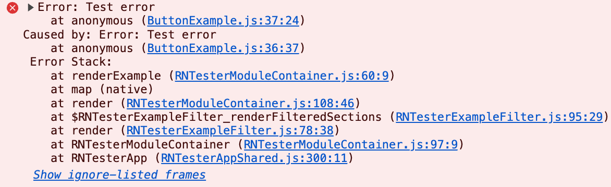

# **React Native 0.81 - Android 16 support, faster iOS builds, and more**

Today we are excited to release React Native 0.81!

This ships with support for Android 16 (API level 36) and includes a variety of other stability improvements and bugfixes, as well as experimental support for faster iOS builds using precompilation.

### Highlights

- [Android 16 support](/blog/2025/08/12/react-native-0.81#android-16-support)
- [SafeAreaView deprecation](/blog/2025/08/12/react-native-0.81#safeareaview-deprecation)
- [Community-maintained JavaScriptCore support](/blog/2025/08/12/react-native-0.81#community-maintained-javascriptcore-support)
- [Experimental Precompiled iOS builds](/blog/2025/08/12/react-native-0.81#experimental-precompiled-ios-builds)

<!--truncate-->

## Highlights

### Android 16 support

Android apps built with React Native 0.81 will now default to targeting **Android 16** (API level 36).

As previously announced by Google, Android 16 requires that [apps are displayed edge-to-edge](https://developer.android.com/develop/ui/views/layout/edge-to-edge) with no support for [opting out](https://developer.android.com/about/versions/16/behavior-changes-16).

To support this, we are deprecating the `<SafeAreaView>` component [as previously announced](https://github.com/react-native-community/discussions-and-proposals/discussions/827) in favor of alternatives. [See below](#safeareaview-deprecation) which will provide better edge-to-edge support.

We are also adding a new gradle property `edgeToEdgeEnabled` to let you choose if you wish to enable edge-to-edge on all supported Android versions beyond 16.

[Predictive back gesture](https://developer.android.com/guide/navigation/custom-back/predictive-back-gesture) is now enabled by default for apps targeting Android 16. The [BackHandler](https://reactnative.dev/docs/backhandler) API should continue to work as before for most use cases. However, if your app relies on custom native code for back handling (such as overriding the `onBackPressed()` method), you may need to manually migrate your code or [temporarily opt-out](https://developer.android.com/guide/navigation/custom-back/predictive-back-gesture#opt-out). Please test your app’s back navigation thoroughly after upgrading.

Google now expects apps to support [adaptive layouts](https://developer.android.com/develop/ui/compose/layouts/adaptive) on large screen devices, regardless of orientation or size restrictions. While you can opt-out for now, it’s recommended to test and update your app for responsive UI on large screens before Android 17.

Starting November 1, 2025, all Google Play app submissions must meet the 16 KB page size requirement for native binaries. This applies to new apps and updates targeting Android 15+ devices. **React Native is already 16KB page size compliant**. Ensure all your native code and third-party libraries are compliant as well.

For more details on Android 16 changes and migration steps, refer to this [post in the discussions-and-proposals](https://github.com/react-native-community/discussions-and-proposals/discussions/921) repository.

### SafeAreaView deprecation

The built-in `<SafeAreaView>` component was originally designed to provide **limited, iOS-only support** for keeping content in the “safe areas” of the screen (away from camera notches, rounded corners, etc). It is not compatible with edge-to-edge rendering on Android, and does not permit customization beyond padding. As a result, many apps have opted for more portable and flexible solutions, such as <code>[react-native-safe-area-context](https://appandflow.github.io/react-native-safe-area-context/)</code>.

In React Native 0.81, the legacy `<SafeAreaView>` component is deprecated, and you will see warnings in React Native DevTools if your app uses it.

It will be removed in a future version of React Native. We recommend that you migrate to `react-native-safe-area-context` or a similar library to ensure your app looks its best across all platforms.

### Community-maintained JavaScriptCore support

[As we announced last year](https://reactnative.dev/blog/2025/04/08/react-native-0.79#jsc-moving-to-community-package), support for the JavaScriptCore (JSC) engine has moved to a [community-maintained package](https://github.com/react-native-community/javascriptcore) that is released separately from React Native itself. In React Native 0.81, we're removing the built-in version of JavaScriptCore. All apps that require JavaScriptCore should now use the community package in order to upgrade to 0.81. [Read the installation instructions](https://github.com/react-native-community/javascriptcore#installation) for the details.

This change does not affect apps that are using Hermes.

### Experimental Precompiled iOS builds

React Native 0.81 introduces precompiled iOS builds, cutting compile times by up to 10x in projects where React Native is the primary dependency. This is the result of a collaboration between Expo and Meta, and expands on [work we previously shipped in React Native 0.80](https://reactnative.dev/blog/2025/06/12/react-native-0.80#experimental---react-native-ios-dependencies-are-now-prebuilt).

This feature is still experimental, but we are hoping to enable it for all apps in a future release. If you’d like to try precompiled builds in your own app, you can enable them by specifying the following environment variables when you run `pod install`:

```bash
RCT_USE_RN_DEP=1 RCT_USE_PREBUILT_RNCORE=1 bundle exec pod install
```

Please provide feedback in [this GitHub discussion](https://github.com/react-native-community/discussions-and-proposals/discussions/923).

There are two limitations we are already aware of, and are working to resolve:

- In precompiled builds, you cannot debug and step into React Native's internals. You can still debug your _own_ native code while using a precompiled version of React Native.
- Prebuilds are not supported in Xcode 26 Beta, because the IDE builds all targets with [Swift explicit modules](https://developer.apple.com/documentation/xcode-release-notes/xcode-26-release-notes#Resolved-Issues-in-Xcode-26-Beta:~:text=Starting%20from%20Xcode%2026%2C%20Swift%20explicit%20modules%20will%20be%20the%20default%20mode%20for%20building%20all%20Swift%20targets)) enabled. To use precompiled builds with Xcode 26, set the `SWIFT_ENABLE_EXPLICIT_MODULES` flag to `NO` in your Xcode project. We will address this in an upcoming patch release.

You can read more about this feature in Expo’s full blog post, [Precompiled React Native for iOS: Faster builds are coming in 0.81](https://expo.dev/blog/precompiled-react-native-for-ios).

## Breaking Changes

### Minimum Node.js bumped to 20

React Native now requires [Node.js](https://nodejs.org/) version 20.19.4 (the latest [Maintenance LTS](https://nodejs.org/en/about/previous-releases) version at the time of writing) or higher. You may need to upgrade Node.js in your development or CI environment when you upgrade to React Native 0.81.

### Minimum Xcode bumped to 16.1

React Native now requires [Xcode 16.1](https://developer.apple.com/documentation/xcode-release-notes/xcode-16_1-release-notes) or higher to build iOS projects. You may need to upgrade Xcode in your development or CI environment when you upgrade to React Native 0.81.

### Metro: Better support for advanced configuration in Community CLI projects

Metro now respects the <code>[resolveRequest](https://metrobundler.dev/docs/configuration#resolverequest)</code> and <code>[getModulesRunBeforeMainModule](https://metrobundler.dev/docs/configuration/#getmodulesrunbeforemainmodule)</code> options if specified in the `metro.config.js` file of a React Native Community CLI project. Previously, setting them would have no effect. If you have custom values for these options in your <code>[metro.config.js](https://metrobundler.dev/docs/configuration/)</code> file, you may need to delete them in order to restore the previous behavior.

### Improved reporting of uncaught JavaScript errors

React Native DevTools now shows the original message and stack trace of uncaught JavaScript errors, as well as the error’s [cause](https://developer.mozilla.org/en-US/docs/Web/JavaScript/Reference/Global_Objects/Error/cause) if any, and an [Owner Stack](https://react.dev/reference/react/captureOwnerStack#owner-stack-vs-component-stack) for errors thrown by components. This makes errors easier to debug and fix.



If you are logging JavaScript errors to your backend or to a third-party error reporting service, this may affect the logs you see after upgrading to React Native 0.81 (for example: you might see more thrown errors that used to be reported via `console.error`), and you may need to update some backend logic accordingly.

### `RN_SERIALIZABLE_STATE` and C++ flags.

In this version of React Native, we introduced a new macro called `RN_SERIALIZABLE_STATE` to support serializable state for the Components on New Architecture.

If you’re a library author and you have a **custom** `CMakeLists.txt` file, you will need to specify this macro in your CMakeLists.txt file or your C++ code could fail to compile.

To support this, we introduce a new CMake function called `target_compile_reactnative_options` which will take care of setting up this macro and all the necessary C++ flags for you. You can invoke it as such in your CMakeLists file:

```cmake
target_compile_reactnative_options(myLibraryName PRIVATE)
```

You can see an example of [how react-native-screens has set up this macro](https://github.com/software-mansion/react-native-screens/pull/3114/commits/b4d283c8fc65e36ec60726fd7513735ccc7e1fe9).

This change will affect only more advanced and complex libraries. If your library is using codegen and you don’t have a custom CMake file, you won’t be affected by this change.

### Other Breaking Changes

This list contains a series of other breaking changes we suspect could have a minor impact to your product code and are worth noting:

#### Android

- We made several classes internal. Those classes are not part of the public API and should not be accessed. We already notified or submitted patches to the affected libraries:
  - `com.facebook.react.fabric.mounting.MountingManager`
  - `com.facebook.react.views.text.TextLayoutManager`
- We moved the `textAlignVertical` [native prop](https://github.com/facebook/react-native/blob/841866c35401ae05fa9c6a2a3e9b42714bbd291e/packages/react-native/ReactCommon/react/renderer/attributedstring/ParagraphAttributes.h#L83) from `TextAttribute.h` to `ParagraphAttribute.h`
  - The prop `textAlignVertical` only affects the top most text view (paragraph view). Yet, it exists in text attribute props nonetheless. To better reflect this platform limitation it was moved to paragraph props.
  - This change is **not** affecting the JS API of the `<Text>` component.
  - You will be affected by this change only if you implement a Fabric component that interacts with the C++ Text API.
  - If you’re affected by this change, you can replace `TextAttributes.h` with `ParagraphAttribute.h` in your code

Read the full list of breaking changes [in the CHANGELOG for 0.81](https://github.com/facebook/react-native/blob/main/CHANGELOG.md#v0810).

## Acknowledgements

React Native 0.81 contains over 1110 commits from 110 contributors. Thanks for all your hard work!

<!--alex ignore special retext-equality-->

We want to send a special thank you to those community members that shipped significant contributions in this release:

- [Christian Falch](https://github.com/chrfalch) for the amazing work on precompiled iOS builds. <!-- // @case-police-ignore Mathieu -->
- [Mathieu Acthernoene](https://github.com/zoontek) for crucial contributions to Android edge-to-edge support
- [Enrique López-Mañas](https://github.com/kikoso) and for helping test Android 16 integration and the SafeAreaView deprecation.

## Upgrade to 0.81

Please use the [React Native Upgrade Helper](https://react-native-community.github.io/upgrade-helper/) to view code changes between React Native versions for existing projects, in addition to the Upgrading docs.

To create a new project:

```
npx @react-native-community/cli@latest init MyProject --version latest
```

If you use Expo, React Native 0.81 will be supported in the upcoming Expo SDK 54 as the default version of React Native.

:::info

0.81 is now the latest stable version of React Native and 0.78.x moves to unsupported. For more information see [React Native's support policy](https://github.com/reactwg/react-native-releases/blob/main/docs/support.md).

:::
