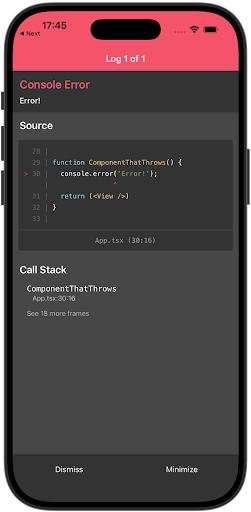
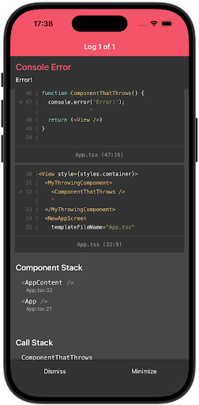
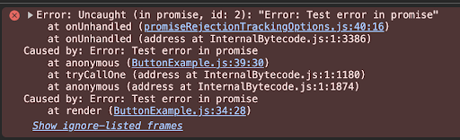

import Tabs from '@theme/Tabs';
import TabItem from '@theme/TabItem';

# **React Native 0.82 - New Architecture Only**

Today we're exited to release React Native 0.82: the first React Native release that removes the legacy architecture and runs entirely on the New Architecture.
<br/> This is a milestone release for React Native and we believe it's the start of a new era. In future versions we will be removing the remaining code from the legacy architecture to reduce install size and streamline the codebase.

In addition, 0.82 also ships with experimental opt-in to a newer version of Hermes called Hermes V1. We’re also enabling several React features by updating the React version to 19.1.1, and shipping support for DOM Node APIs.

### Highlights

- [New Architecture Only](/blog/2025/10/08/react-native-0.82#new-architecture-only)
- [Experimental Hermes V1](/blog/2025/10/08/react-native-0.82#experimental-hermes-v1)
- [React 19.1.1](/blog/2025/10/08/react-native-0.82#react-1911)
- [DOM Node APIs](/blog/2025/10/08/react-native-0.82#dom-node-apis)

<!--truncate-->

# Highlights

## New Architecture Only

In React Native 0.76 we announced that [The New Architecture](/blog/2024/10/23/the-new-architecture-is-here) became the default architecture. Since then, the New Architecture has been tested and refined and we're confident in making it the only architecture.

Starting today, new versions of React Native will **only** run with the New Architecture. This means, if you try to set `newArchEnabled=false` on Android, or if you try to install CocoaPods with `RCT_NEW_ARCH_ENABLED=0` on iOS, these will be ignored and your app will still run with the New Architecture enabled.

### How to migrate

If you haven’t migrated your project to the New Architecture, we recommendation first migrating your project to React Native 0.81 or Expo SDK 54. These are the last versions that allow you to opt-in to the Legacy Architecture. They contain warning and performance improvements specifically to help migrating to the New Architecture.
<be/> Then enable the New Architecture in 0.81 and verify that your application is working fine.
<br/> Once you're using the New Architecture in 0.81, you can update safely to React Native 0.82 which removes the legacy achitecture.

If an incompatible 3rd party dependency prevents you from migrating to the New Architecture, we recommend you reach out to the library maintainers directly.

If a bug in React Native core prevents you from migrating, we recommend you reach out to us [through our issue tracker](https://github.com/facebook/react-native/issues/new/choose).

### Interop Layers & 3P library compatibility

We will keep the interop layers in the codebase for the foreseeable future. All the classes and functions that are required by the interop layers won’t be removed anytime soon. We will share further updates in the future regarding the removals of Interop Layers later on.

We’ve also verified that the 3P libraries that offer backward compatibility with both old and New Architectures will keep on working with 0.82 where New Architecture is the only architecture.

### Removal of Legacy Architecture classes

To ensure backward compatibility and reduce breaking changes, we are not removing any APIs of the Legacy Architecture from the core of React Native in this version. Removing the Legacy Architecture will allow us to save significant size on the overall bundle size, therefore the removal is scheduled to start from the next version of React Native.

You can find more information in [RFC0929: Removal of the Legacy Architecture of React Native](https://github.com/react-native-community/discussions-and-proposals/pull/929).

## Experimental Hermes V1

React Native 0.82 adds support for opting into Hermes V1.

Hermes V1 is the next evolution of Hermes. We've been experimenting with it internally in our apps, and it is now time for the community to try it as well. It comes with improvements in the compiler and in the VM that boosts Hermes performance.

From initial tests and benchmarks, Hermes V1 outperforms Legacy Hermes in various scenarios. We have seen improvements in bundle loading and TTI. The improvements strongly depend on the details of your apps.

On the [Expensify app](https://github.com/Expensify/App), a real world and complex application, we have seen the following improvements:
| Metric | Android (low end device) | iOS |
| --- | --- | --- |
| Bundle Load Time | 3.16% faster | 9% faster |
| Total TTI | 7.62% faster | 2.5% faster |
| Content TTI | 7.19% faster | 7.5% faster |

For Total TTI, we measured the time it takes from bundle loading to when the first screen in the app is rendered and it is interactive.

For Content TTI, we measured the time it takes for a component to be interactive from the first rendering of the component itself.

Hermes V1 does not yet contain JS-to-native compilation (previously known as “Static Hermes”) or the JIT compilation that was [presented during React Native EU 2023](https://www.youtube.com/watch?v=q-xKYA0EO-c). We are still testing these features, and will share more as we make progress.

### How to enable Hermes V1

:::info

While Hermes V1 is in the experimental phase, in order to try it, you’ll need to build React Native from source. Once Hermes V1 ships as default in a future React Native version, this restriction will be lifted.

:::

To try Hermes V1 in your own project, use the following steps:

1. Force your package manager to resolve the experimental version of Hermes V1 compiler package by modifying the corresponding section of your `package.json` file (note that the current versioning convention is only for the experimental phase of Hermes V1):

<Tabs>
  <TabItem label="yarn" value="yarn" default>
    ```
    "resolutions": {
        "hermes-compiler": "250829098.0.1"
    }
    ```
  </TabItem>
  <TabItem value="npm" label="npm">
    ```
    "overrides": {
        "hermes-compiler": "250829098.0.1"
    }
    ```
  </TabItem>
</Tabs>

2. Enable Hermes V1 for Android by adding `hermesV1Enabled=true` inside the `android/gradle.properties` file, and configure React Native [to build from source](https://reactnative.dev/contributing/how-to-build-from-source#android) by editing `android/settings.gradle`:

<Tabs>
  <TabItem value="android/gradle.properties" label="android/gradle.properties" default>
    ```diff
    + hermesV1Enabled=true
    ```
  </TabItem>
  <TabItem label="android/settings.gradle" value="android/settings.gradle">
    ```diff
    + includeBuild('../node_modules/react-native') {
    +    dependencySubstitution {
    +        substitute(module("com.facebook.react:react-android")).using(project(":packages:react-native:ReactAndroid"))
    +        substitute(module("com.facebook.react:react-native")).using(project(":packages:react-native:ReactAndroid"))
    +        substitute(project(":packages:react-native:ReactAndroid:hermes-engine")).using(module("com.facebook.hermes:hermes-android:250829098.0.1"))
    +    }
    + }
    ```
  </TabItem>
</Tabs>

3. Enable Hermes V1 for iOS by installing pods with `RCT_HERMES_V1_ENABLED=1` environment variable. Keep in mind that Hermes V1 is not compatible with the precompiled React Native builds, so make sure you don’t use the `RCT_USE_PREBUILT_RNCORE` flag when installing pods:

```sh
RCT_HERMES_V1_ENABLED=1 bundle exec pod install
```

4. To verify whether the app is running Hermes V1, you could run the following in your JavaScript code or DevTools console:

```jsx
HermesInternal.getRuntimeProperties()['Static Hermes'] === true;
```

## React 19.1.1

This release of React Native ships with the latest React stable: [React 19.1.1](https://github.com/facebook/react/releases/tag/v19.1.1).

This release of React contains full support for owner stacks for React Native. Back in React Native 0.80, when we shipped support for 19.1.0, we [mentioned](/blog/2025/06/12/react-native-0.80#react-1910) that owner stacks were not fully supported if you were using the [`@babel/plugin-transform-function-name`](https://babeljs.io/docs/babel-plugin-transform-function-name) Babel plugin. This release lifts this restriction and enables owner stacks for all React Native users.

| BEFORE                                                                                                            | AFTER                                                                                                         |
| ----------------------------------------------------------------------------------------------------------------- | ------------------------------------------------------------------------------------------------------------- |
| <center></center> | <center></center> |

React 19.1.1 also improves the reliability of [`useDeferredValue`](https://react.dev/reference/react/useDeferredValue) and [`startTransition`](https://react.dev/reference/react/startTransition) in a Suspense boundary for React Native. These are essential React features, designed to boost app responsiveness. Previously both were wrongly showing the fallback component when used together with a Suspense boundary on React Native. With React 19.1.1, they now consistently perform as expected on React Native, aligning their behavior with Web.

## DOM Node APIs

Starting from React Native 0.82, native components will provide DOM-like nodes via refs.

<!--alex ignore just retext-equality-->

Before, native components provided React Native-specific objects with just a handful of methods like `measure` and `setNativeProps`. After this release, they will provide [nodes implementing a subset of the DOM API](https://reactnative.dev/docs/element-nodes) that allow traversing the UI tree, measuring layout, etc. as they do on Web, e.g.:

```jsx
function MyComponent(props) {
  const ref = useRef();

  useEffect(() => {
    const element = ref.current;

    // New methods
    element.parentNode;
    element.parentElement;
    element.childNodes;
    element.children;
    const bounds = element.getBoundingClientRect();
    const doc = element.ownerDocument;
    const maybeElement = doc.getElementById('some-view');

    // Legacy methods are still available
    element.measure((x, y, width, height, pageX, pageY) => {
      /* ... */
    });
  }, []);

  return <View ref={ref} />;
}
```

Additionally, this will expose access to leaf [text nodes](https://reactnative.dev/docs/text-nodes) (created by the `Text` component) and [document nodes](https://reactnative.dev/docs/document-nodes) representing React Native root nodes.

This is a backwards compatible change, as the new nodes will continue implementing the legacy methods (like `measure`).

For more information, please check our [documentation](https://reactnative.dev/docs/nodes).

## Other changes

### Web Performance APIs (Canary)

React Native now implements a subset of the performance APIs available on Web:

- [High Resolution Time](https://www.w3.org/TR/hr-time-3/): defines `performance.now()` and `performance.timeOrigin`.
- [Performance Timeline](https://w3c.github.io/performance-timeline/): defines `PerformanceObserver` and methods to access performance entries in the performance object (`getEntries()`, `getEntriesByType()`, `getEntriesByName()`).
- [User Timing](https://w3c.github.io/user-timing/): defines `performance.mark` and `performance.measure`.
- [Event Timing API](https://w3c.github.io/event-timing/): defines `event` entry types reported to `PerformanceObserver`.
- [Long Tasks API](https://w3c.github.io/longtasks/): defines `longtask` entry types reported to `PerformanceObserver`.

They allow tracking different aspects of performance in your app at runtime (for telemetry) and they will be visible in the performance panel in React Native DevTools (available in a future version of React Native).

They are currently **available only in the [canary release level](https://reactnative.dev/docs/next/releases/release-levels)**, and will be released as stable in a future version of React Native.

### Create a `debugOptimized` build type for Android

Starting with React Native 0.82, you will be able to use the `debugOptimized` build type to speed up your development experience.

Historically, Android creates two default build variants:

- `debug`, used by default when developing and that allows you to connect to the various debugger tools such as React Native DevTools, Metro, the Android JVM and C++ debugger
- `release`, used when shipping your application to production. This is fully optimized, with obfuscation and optimization that will make debugging harder.

As most React Native developers won’t need to use the C++ debugger when developing, we introduced the `debugOptimized` build type.

With `debugOptimized` your animations and re-rendering will be faster, because you’re running a React Native build with several C++ optimizations enabled. At the same time you will still be able to use React Native Dev Tools to debug your JavaScript code.

When using `debugOptimized`, you won’t be able to use the JVM or C++ native debuggers, but you will still be able to use them if you use the `debug` build type.

To run the `debugOptimized` variant for your app built with the Community CLI you can invoke:

<Tabs>
  <TabItem label="Raw React Native" value="Raw React Native" default>
    ```
    npx react-native run-android --mode debugOptimized
    ```
  </TabItem>
  <TabItem value="Expo" label="Expo">
    ```
    npx expo run:android --variant debugOptimized
    ```
  </TabItem>
</Tabs>

:::info

The `debugOptimized` build type has also been backported to React Native 0.81 and Expo SDK 54.

:::

You can see the `debugOptimized` in action in these samples where we’re rendering several animations on screens.

The build running `debug` is running at ~20FPS while the `debugOptimized` one is running at ~60FPS:
| `debug` | `debugOptimized` |
| ------- | ---------------- |
|  |  |

## Breaking Changes

### Uncaught promise rejections will now raise `console.error`

Following the [improvement of reporting uncaught JavaScript errors](/blog/2025/08/12/react-native-0.81#improved-reporting-of-uncaught-javascript-errors) in the previous version, we will now be reporting uncaught promises through that mechanism as well:



Due to a bug, these were completely swallowed and ignored previously, so please expect some pre-existing errors to surface after upgrading to React Native 0.81. For that reason, previously pre-existing errors might also surface in JavaScript errors reported to your backend, and create a surge in new reports.

### Other Breaking Changes

#### General

- Move `ReactNativeFeatureFlags` to `src/private`
  - In general you should not depend on `ReactNativeFeatureFlags` at all as that is a private API.
- Type of `Appearance.setColorScheme()` has been updated to no longer accept a nullable value
  - Use 'unspecified' instead of null/undefined in the edge case that the color scheme needs to be reset.

#### iOS

- Migrated `RCTDisplayLink` away from legacy api `RCTModuleData` as we plan to remove it in the future.

#### Android

- Class `com.facebook.react.bridge.JSONArguments` is removed as was accidentally `public`
- Deprecate `MessageQueueThreadPerfStats`
  - We deprecated this API and replaced it with stub. You should not rely on stats from this API anymore as the provided stats were not reliable
- Bump Gradle from 8.x to 9.0.0
  - List of all the changes in the next major stable version of Gradle 9.0.0 is available [here](https://gradle.org/whats-new/gradle-9/) but we expect no impact at all to users

#### C++

- Delete backward compatibility headers for `CallbackWrapper.h` / `LongLivedObject.h`
  - The correct include for those headers is `#include <react/bridging/LongLivedObject.h>` and `#include <react/bridging/CallbackWrapper.h>`.
  - You should not use the old includes under `#import <ReactCommon/….h>`

Read the full list of breaking changes in the [CHANGELOG for 0.82](https://github.com/facebook/react-native/blob/main/CHANGELOG.md#v0820).

## Acknowledgements

React Native 0.82 contains over 868 commits from 93 contributors. Thanks for all your hard work!

We want to send a special thank you to those community members that shipped significant contributions in this release:

- [Dawid Małecki](https://github.com/coado) and [Jakub Piasecki](https://github.com/j-piasecki) for the help in rolling out Hermes V1.
- [Krystof Woldrich](https://github.com/krystofwoldrich) for the support with fixing the swallowing of uncaught promise rejections.
- [Riccardo Cipolleschi](https://github.com/cipolleschi) for the support with writing the React 19.1.1 and Hermes V1 paragraph above.
- [Rubén Norte](https://github.com/rubennorte) for the support with writing the DOM API and Performance API paragraphs.
- [Tomasz Zawadzki](https://github.com/tomekzaw/) for the support with the `debugOptimized` benchmarking.

## Upgrade to 0.82

Please use the [React Native Upgrade Helper](https://react-native-community.github.io/upgrade-helper/) to view code changes between React Native versions for existing projects, in addition to the Upgrading docs.

To create a new project:

If you use Expo, React Native 0.82 will be available as part of the expo@canary releases.

The next stable SDK 55 will be shipped with the next stable release of React Native: 0.83.

:::info

0.82 is now the latest stable version of React Native and 0.79.x moves to unsupported. For more information see [React Native's support policy](https://github.com/reactwg/react-native-releases/blob/main/docs/support.md).

:::
